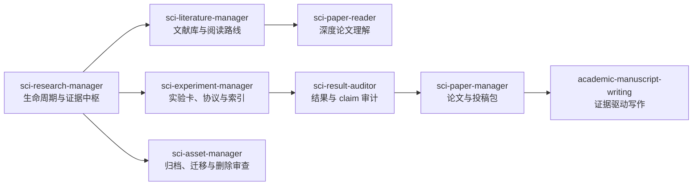

# SCI Research Codex Skills

面向长期、证据驱动科研项目的 Codex Skills。当前版本：**2.0.0**。

这套系统让 Codex 不只会“写一段论文”或“跑一个实验”，而是能在跨会话、跨阶段的研究中保存方向、追溯证据、约束 claim、保护工作区，并把专门任务路由给合适的 Skill。

## v2 的核心变化

- 保留仓库名和全部 8 个原有 Skill 名称。
- 将 `sci-research-manager` 升级为统一科研生命周期中枢。
- 收敛阶段、实验状态、证据状态、claim 强度和方向决策，避免状态词漂移。
- 去除写死的 `research_workspace/`、teacher/student、特定数据集和特定研究方向假设。
- 新增工作区只读审计、文件时间/provenance 保护、E/F 实验卡生成、双格式索引和通用一致性审计。
- 为全部 Skill 补齐 `agents/openai.yaml`。
- 新增零第三方依赖的自动化测试和 GitHub Actions。

## 设计原则

1. **事实高于会话记忆**：原始结果、配置、commit 和冻结协议优先于实验卡、HANDOFF 和聊天摘要。
2. **文献不是项目证据**：论文可以产生假设，不能替代项目实验。
3. **先根因，后训练**：失败后先找被证伪的假设和竞争解释，不直接加 epoch、loss 或 head。
4. **claim 必须可追溯**：每个论文主张都要对应兼容协议下的证据。
5. **维护默认只读**：整理不自动删除、移动、提交、推送或重写原始资产时间。
6. **低上下文检索**：先 HANDOFF、QUERY_MAP、索引，再读卡片和原始文件。

## 系统结构



`sci-research-manager` 负责状态、方向、证据边界和收尾；其他 Skill 只负责自己的专门领域。项目自己的 `AGENTS.md`、schema 和事实来源始终优先。

## 8 个原有 Skill

| Skill | 负责 | 不负责 |
|---|---|---|
| `sci-research-manager` | 项目恢复、方向决策、证据层级、维护和交接 | 代替所有内容专门 Skill |
| `sci-literature-manager` | 文献发现、索引、验证队列、阅读路线 | 把文献当项目结果 |
| `sci-paper-reader` | 源材料驱动的深度理解包、图表 proof cards | 创建项目实验结果 |
| `sci-experiment-manager` | E/F 编号、冻结协议、卡片、索引、结果闭环 | 决定论文方向 |
| `sci-result-auditor` | 只读证据、协议、claim 和文件一致性审计 | 静默修复证据 |
| `sci-paper-manager` | claim map、paper status、图表计划、投稿包 | 凭空补结果或猜投稿要求 |
| `sci-asset-manager` | 迁移/归档/删除风险审查 | 未授权删除或移动 |
| `academic-manuscript-writing` | 证据边界固定后的学术写作 | 路线决策和证据仲裁 |

## 安装

克隆仓库：

```bash
git clone https://github.com/godzhiwzz-create/sci-research-codex-skills.git
cd sci-research-codex-skills
```

安装全部 Skill：

```bash
mkdir -p ~/.codex/skills
cp -R skills/* ~/.codex/skills/
```

只安装生命周期中枢：

```bash
cp -R skills/sci-research-manager ~/.codex/skills/
```

升级已有安装前先备份本地自定义内容，再用同名目录覆盖；v2 沿用全部原名称，不要求迁移触发词。

安装或升级后重新加载 Codex Skill 列表。

## 快速开始

恢复长期项目：

```text
Use $sci-research-manager to resume this project.
Read the lightest authoritative context, separate verified evidence from session-only memory,
and tell me the blocker and safest next action.
```

建立实验记录：

```text
Use $sci-experiment-manager to create F012-D01.
Freeze the protocol, controls, promotion gate, stop gate, paths, and claim boundary before execution.
```

投稿前审计：

```text
Use $sci-result-auditor to audit the manuscript, result registry, claim map,
public code, and protocol consistency without modifying source evidence.
```

## 推荐项目入口

Skill 不强制一个物理目录。已有项目应沿用自己的结构；新项目可从下面的职责分层开始：

```text
AGENTS.md                  # Agent 行为和读写边界
README.md                  # 项目入口与所有权
HANDOFF.md                 # 当前状态、证据、blocker、下一动作
SESSION_MEMORY.md          # 稳定跨会话认知；不替代原始证据
experiments/
  QUERY_MAP.md
  EXPERIMENT_INDEX.csv
  cards/
paper/
  PAPER_STATUS.md
  CLAIM_EVIDENCE_MAP.md
literature/
  LITERATURE_INDEX.md
```

旧版 `PROJECT_HANDOFF.md` 和 `research_workspace/` 继续兼容，但不再是硬编码前提。

## 内置工具

| 工具 | 作用 | 默认安全边界 |
|---|---|---|
| `sci-research-manager/scripts/audit_workspace.py` | 检查入口、Markdown 本地链接、软链接和嵌套 Git 状态 | 只读 |
| `sci-research-manager/scripts/provenance_guard.py` | 记录/核验 size、mtime、symlink target、可选 SHA-256 | 不改原资产 |
| `sci-experiment-manager/scripts/generate_experiment_card.py` | 创建 E/F 卡片 | 拒绝覆盖 |
| `sci-experiment-manager/scripts/update_experiment_index.py` | 生成 Markdown/CSV 索引 | 只写 `.generated.*` |
| `sci-experiment-manager/scripts/collect_results.py` | 汇总 `results.csv` | 只写 generated 表 |
| `sci-result-auditor/scripts/check_project_consistency.py` | 核对 ID、卡片、raw path、claim map 和 handoff | 默认 stdout，只读 |
| `sci-paper-reader/scripts/check_html_assets.py` | 检查本地视觉资产 | 只读 |

所有脚本支持 `--help`。在非标准项目中显式传入 root、目录和输出路径。

## 测试

本地运行：

```bash
python -m unittest discover -s tests -v
```

测试覆盖：

- 8 个 Skill 的 frontmatter、名称、长度、引用和 UI 元数据；
- Markdown/HTML 本地链接；
- 工作区审计的正常与故障路径；
- provenance 快照、mtime/hash/软链接和越界保护；
- E/F 卡片生成、不覆盖、索引、结果汇总；
- claim/index/card/raw-result 一致性；
- HTML 本地资产检查。

GitHub Actions 在 Python 3.10、3.11 和 3.13 上运行同一测试集。

## 教程与演示

- [教程导航](docs/tutorials/README.md)
- [项目管理教程](docs/tutorials/project-management.md)
- [论文精读教程](docs/tutorials/paper-deepread.md)
- [Attention Is All You Need 精读演示](docs/tutorials/examples/attention-is-all-you-need/README.md)
- [GitHub Pages](https://godzhiwzz-create.github.io/sci-research-codex-skills/)

## 兼容策略

- 仓库名和 8 个 Skill 文件夹名保持不变。
- 旧模板和 `research_workspace/` 路径仍可读；新脚本允许显式配置路径。
- v2 收敛状态词，但遇到已有项目 schema 时不强制批量改名。
- 生成器不自动覆盖人工维护的 canonical 文件。
- 重大行为变化先经过结构测试、脚本测试和独立只读前向测试。

## License

MIT，见 [LICENSE](LICENSE)。
