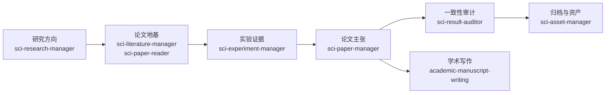

# SCI Research Codex Skills

面向长期 SCI 论文研究项目的 Codex Skills。

这套技能不是为了让 Codex 只会“写一段论文”或“跑一个实验”。它的目标是把 Codex 变成一个长期研究协作助手：能记住研究方向，管理实验和论文证据，先读论文再设计实验，避免把失败路线反复调参，最后把结果沉淀成可审计、可写作、可复用的研究材料。

## 解决什么问题

长期科研项目最容易乱在几个地方：

- 方向越做越窄：本来在找新问题，最后变成调 loss、加 seed、改 head。
- 实验越做越乱：结果、配置、日志、结论散在不同文件夹里，过几天自己也找不到。
- 论文越写越虚：实验还没支持的结论，被自然地写成了“证明”。
- 文献读得不落地：读了很多论文，但没有变成变量、控制、失败标准和实验设计。
- 复盘只看涨跌：知道某条路线失败了，却不知道到底是信号错、接口错、监督错还是域外失效。

这套 skills 把研究工作拆成几个层次，让每一步都有自己的职责和边界。



## 教程入口

如果你第一次打开这个仓库，建议不要从每个 `SKILL.md` 逐个读起。先看教程入口：

| 入口 | 适合谁 | 你会看到什么 |
|---|---|---|
| [教程导航](docs/tutorials/README.md) | 想快速知道这套 skills 怎么连起来用 | 项目管理、论文精读、实验卡、写作审计的路线图 |
| [项目管理教程](docs/tutorials/project-management.md) | 项目已经乱了，想让 Codex 帮你接管长期研究记忆 | `PROJECT_HANDOFF`、实验索引、方向决策、失败原因复盘的完整示例 |
| [论文精读教程](docs/tutorials/paper-deepread.md) | 想把一篇论文读成“我真的懂了”的 MD/HTML/PPT/Obsidian 包 | 中文摘要解读、图表 proof card、证据线、项目挂接模块示例 |
| [论文精读演示包](docs/tutorials/examples/attention-is-all-you-need/README.md) | 想直接看成品效果 | `Attention Is All You Need` 的中文 MD + HTML + 自绘图演示 |

### 两个最推荐的展示场景

**1. 项目管理：让长期研究不再变成文件迷宫**

```text
用户：这个方向跑了十几个实验，现在我看不懂了，帮我整理。

Codex 输出：
1. 当前阶段：result_analysis / direction_review
2. 中心问题：某信号是否真的解释了目标失败
3. 已支持证据：E003, E009
4. 负向边界：F012-D01, F012-D04, F018-D02
5. 不要继续做：加 epoch、调 loss、换 head
6. 下一步：先做 no-training cause diagnostic，再决定是否 minimal_probe
```

**2. 论文精读：不是摘要，而是一份可复用的理解包**

```text
用户：读这篇学术论文，中文讲清楚，做成 HTML。

Codex 输出：
paper_title/
  paper.pdf
  paper_understanding_YYYYMMDD.md
  paper_visual_YYYYMMDD.html
  assets/
    abstract_crop.png
    figure_2_method_flow.png
    assistant_drawn_mechanism.png

内容包含：
- 英文标题 + 中文副标题
- 摘要截图 + 摘要逐段解读
- 方法路线图
- 关键图表 proof cards
- 证据链和局限
- 和其他论文的关系
- 日期校准的项目启发模块
```

可直接查看演示：[Attention Is All You Need 精读演示包](docs/tutorials/examples/attention-is-all-you-need/README.md)。

## 每个 skill 集成了哪些功能

### `sci-research-manager`：研究路线与方向探索中枢

用于“现在该往哪走、为什么失败、要不要停”的研究决策层。

集成功能：

- 项目启动 / 恢复：读取 `PROJECT_HANDOFF.md`、计划、阶段和决策日志。
- 阶段判断：区分 `idea_exploration`、`minimal_probe`、`formal_experiment`、`result_analysis`、`paper_writing`、`submission_prepare`、`maintenance`。
- 方向探索闭环：按 `problem -> cause -> method hypothesis -> tool role -> validation requirement -> result interpretation -> next problem` 推进。
- SCI 论文级问题流程：先问问题和根因，再谈机制、工具、验证和 stop gate。
- 失败原因分类：signal mismatch、task mismatch、interface mismatch、supervision mismatch、carrier mismatch、real-domain support mismatch、control/confound failure。
- 防调参护栏：明确禁止失败后直接加 epoch、seed、loss、head、gate、verifier、query residual、box delta。
- reference track / main track 分离：防止把强成熟框架的小优化误当原创主线。
- go / redirect / reference_only / stop / needs_literature 决策输出。
- 模板：`PROJECT_HANDOFF.md`、`PROJECT_PLAN.md`、`STAGE_PLAN.md`、`DECISION_LOG.md`、`RISK_REGISTER.md`。

不负责：

- 不直接管理具体实验索引细节。
- 不替代论文库检索和实验卡维护。

### `sci-literature-manager`：独立论文库与阅读路线管理

用于“先从论文建立地基”，把文献从实验文件夹中独立出来。

集成功能：

- 论文库目录标准：按论文分类 / 论文题目组织 PDF、MD、HTML、素材包和 README。
- 文献发现与整理：建立 seed manifest、paper card、reading route、source verification queue。
- 文献索引：维护 `LITERATURE_QUERY_MAP.md`、`LITERATURE_INDEX.md`、阅读队列和分类入口。
- 问题导向阅读路线：把论文映射到 problem、cause、variables、controls、failure modes。
- 文献到实验交接：生成 experiment-facing literature brief，但不创建实验结果。
- 查重 / 验证队列：标记 title、venue、DOI、arXiv、PDF、代码链接等需要核验的字段。
- 与 `sci-paper-reader` 协作：负责找和管论文，精读交给 paper reader。

不负责：

- 不把论文结论当项目实验证据。
- 不维护实验结果、checkpoint 或 claim-evidence map。

### `sci-paper-reader`：中文论文精读 / Deep Reader

用于“给一篇论文，做出像认真读完一样的理解包”。这就是刚打磨的 deepreader 工作流，现在已并入 `sci-paper-reader`，不再作为单独 skill 混用。

集成功能：

- Markdown-first 精读包：先写完整 `paper_understanding.md`，再派生 HTML / PPT / Word / Obsidian。
- 中文深度讲解：不是摘要式 bullet，而是讲清 problem、gap、method principle、mechanism、evidence、limitations、paper relation。
- 论文身份页：英文标题 + 中文副标题，作者、venue/year、paper type、source status、期刊/会议说明。
- 摘要截图与摘要解读：要求有 abstract/front-page crop，并解释摘要承诺、核心假设、输出和未证明内容。
- 证据线重建：`problem -> claimed cause -> method principle -> proof object -> ablation -> limitation -> project implication`。
- 图表精读卡：每张关键图/表说明“看哪里、证明什么、用什么 control、不能证明什么”。
- 视觉 HTML 规范：支持截图、原文图表 crop、assistant-drawn 架构图/机制图、导航、proof cards、项目 attachment。
- 截图排版规则：保留图像长宽比，页面适应截图，不拉伸图表。
- Obsidian / Word / PPT 协调：可输出 Obsidian 结构、Word 文档，PPT 可交给 `deckforge-paper2ppt`。
- 项目挂接模块：正文讲论文本身，最后单独写带日期的 project attachment，避免被当前项目视角污染。
- 内置参考文件：
  - `references/packet_schema.md`：完整精读包结构。
  - `references/evidence_spine.md`：证据链和图表 proof-card 规则。
  - `references/html_visual_guidelines.md`：视觉 HTML 排版与图表解释规范。
- 内置脚本：
  - `scripts/check_html_assets.py`：检查 HTML 引用的本地图像是否缺失或为空。

不负责：

- 不把论文直接升级为项目 claim。
- 不创建实验 ID 或训练计划，除非先输出 literature-to-experiment brief。

### `sci-experiment-manager`：实验卡、索引和证据检索

用于“实验怎么记录才不会乱”，重点是低 token 检索和证据链。

集成功能：

- 实验 ID 规则：正式实验用 `E001`，方向族和多 probe 用 `F012-D01` 这类 family/sub-study。
- 实验卡模板：记录 hypothesis、setup、config path、run path、result path、summary、status、paper role、tags、related experiments、keep/archive。
- Family card：把多个小实验合并为一个方向族，避免 active 文件夹被几十个子实验淹没。
- Query map 检索：先用 `QUERY_MAP.md` 找相关 family，再读 index 和卡片。
- 实验索引：维护 `EXPERIMENT_INDEX.md` 和 `EXPERIMENT_INDEX.csv`。
- 结果收集脚本：
  - `scripts/generate_experiment_card.py`
  - `scripts/update_experiment_index.py`
  - `scripts/collect_results.py`
- 合并 / 归档逻辑：多个实验合一时保留 canonical family card，子卡归档或并入 synthesis block。
- Paper role 管理：区分 main_result、diagnostic_only、negative_evidence、internal_exploration 等。

不负责：

- 不设计研究方向本身。
- 不写论文主张，不替代 claim-evidence map。

### `sci-paper-manager`：论文主张、草稿和投稿包管理

用于“论文怎么写才不虚”，把实验结果变成可审计的论文结构。

集成功能：

- `draft_core` / `submission_targets` 两阶段：先写通用论文核心，再做目标期刊/会议格式。
- Claim-evidence map：维护 `CLAIM_EVIDENCE_MAP.md`，每个主张必须对应证据。
- Paper status：记录论文当前状态、中心故事、已支持/未支持 claims。
- Figure/table plan：维护 `FIGURE_PLAN.md`、`TABLE_PLAN.md`。
- Claim 强度分级：main_claim、trend_only、diagnostic_only、negative_boundary、internal_exploration、unsupported。
- 投稿要求缓存：目标期刊/会议确定后，把官方 author guideline、template、word/page limits、figure/table/supplementary、ethics/funding/data/code availability 写进 `guideline_notes.md`。
- 投稿包模板：submission checklist、format compliance report、revision log、section template。

不负责：

- 不凭空补结果。
- 不在没有官方 guideline 时猜投稿格式。

### `sci-result-auditor`：结果、主张和项目一致性审计

用于“我现在写的东西到底有没有证据支撑”。

集成功能：

- 项目一致性检查：实验卡、索引、claim map、paper status、草稿之间是否一致。
- 脚本审计：
  - `scripts/check_project_consistency.py`
- Claim audit：检查 unsupported claim、旧路线残留、探索结果被误写成正式贡献。
- 实验审计：检查 dataset split、seed、config、metric、baseline、公平性和 raw path。
- 复现审计：检查 config/result/log 路径是否可追溯。
- go/no-go 决策：对 minimal probe 给出 go、pause、blocked、stop。
- 审稿人视角：指出最容易被质疑的证据漏洞。

不负责：

- 不发明新方向。
- 不修改结果，除非用户明确要求修复记录。

### `sci-asset-manager`：资产清理、冷归档和删除审查

用于“项目文件太乱，但不能误删证据”。

集成功能：

- 删除前审查：生成 `delete_review.md`，列路径、原因、实验 ID、证据风险和建议动作。
- 冷归档清单：`cold_archive_manifest.md`。
- 投稿保留清单：`submission_keep_list.md`。
- Archive review：阶段结束、draft_core 完成、投稿前做归档审查。
- 保留规则：永远保留 experiment card、config、result summary、run command、archive note、claim relation。
- 可清理对象：大 checkpoint、cache、重复日志、临时输出、失败中间权重。

不负责：

- 不直接删除文件，除非用户明确下令。
- 不决定研究路线是否继续。

### `academic-manuscript-writing`：证据驱动的英文学术写作

用于“研究路线和证据边界已经清楚后，把论文段落写好”。

集成功能：

- 英文 manuscript drafting / rewriting：摘要、引言、related work、methods、results、discussion、conclusion。
- Section playbooks：不同论文部分的组织方式。
- Evidence-chain writing：把实验角色变成论文章节逻辑。
- Figure/table narration：写清楚图表测什么、模式是什么、为什么支持结论。
- Journal-style English：更克制、更证据化的学术表达。
- Claim calibration：避免 robust / significant / superior 等过度表述。
- 参考文件：
  - `references/workflow.md`
  - `references/section-playbooks.md`
  - `references/evidence-chain.md`
  - `references/figure-table-writing.md`
  - `references/style-rules.md`
  - `references/examples.md`

不负责：

- 不替代研究路线决策。
- 不判断实验是否足够支撑 claim；这个先交给 `sci-paper-manager` / `sci-result-auditor`。

## 核心工作流

### 1. 方向探索先问原因

当一个方向失败，不直接问“要不要多训几轮”，而是先问：

```text
问题是什么 -> 原因是什么 -> 方法假设是什么 -> 需要什么工具/机制
-> 如何验证 -> 结果说明什么 -> 下一个问题是什么
```

`sci-research-manager` 会强制区分几类失败原因：

- 信号不匹配：这个 cue 根本不是任务需要的 factor。
- 任务不匹配：cue 有意义，但不适合当前预测目标。
- 接口不匹配：cue 放错了决策层。
- 监督不匹配：loss/target 没表达真正现象。
- 载体不匹配：当前 detector 或 pipeline 不能自然使用这个机制。
- 真实域支持不足：合成域有信号，真实域不安全。
- 控制实验解释掉了：RGB、metadata、shuffle 或 detector-native statistics 已经解释了增益。

### 2. 文献先变成问题，不直接变成模块

论文不是“看见一个模块就插进项目里”。文献层必须先产出：

```text
hypothesis
theory
variables / cues
controls
success criteria
failure criteria
risks
do-not-do-next
```

只有当这些内容清楚后，实验层才创建 experiment ID、experiment card、config path、run path 和 result path。

### 3. 实验不是文件夹分类，而是证据链

`sci-experiment-manager` 关注低 token 检索，而不是漂亮目录。每个实验要能回答：

- 它验证了哪个假设？
- 它支持了什么？
- 它没有支持什么？
- 哪个假设被削弱或证伪？
- 下一步是继续、暂停、重定向还是停止？

探索路线可以用 family card 收束，避免几十个子实验都堆在 active 文件夹里。

### 4. 论文主张必须有证据边界

`sci-paper-manager` 要求每个 claim 都进入 `CLAIM_EVIDENCE_MAP.md`。

如果证据不足，就标记：

- `unsupported`
- `needs verification`
- `trend_only`
- `diagnostic_only`
- `negative_boundary`
- `internal_exploration`

这样可以防止把一个内部探索结果写成正式论文贡献。

## 推荐项目结构

```text
PROJECT_HANDOFF.md
AGENTS.md
research_workspace/
  experiments/
    QUERY_MAP.md
    EXPERIMENT_INDEX.md
    EXPERIMENT_INDEX.csv
    cards/
  literature/
    indexes/
    paper_packets/
    reading_routes/
  paper/
    PAPER_STATUS.md
    CLAIM_EVIDENCE_MAP.md
    FIGURE_PLAN.md
    TABLE_PLAN.md
  project/
    DECISION_LOG.md
    STAGE_PLAN.md
    PROJECT_PLAN.md
```

## 安装

克隆仓库：

```bash
git clone https://github.com/godzhiwzz-create/sci-research-codex-skills.git
```

安装全部技能：

```bash
mkdir -p ~/.codex/skills
cp -R sci-research-codex-skills/skills/* ~/.codex/skills/
```

只安装核心研究流：

```bash
mkdir -p ~/.codex/skills
cp -R sci-research-codex-skills/skills/sci-research-manager ~/.codex/skills/
cp -R sci-research-codex-skills/skills/sci-literature-manager ~/.codex/skills/
cp -R sci-research-codex-skills/skills/sci-paper-reader ~/.codex/skills/
cp -R sci-research-codex-skills/skills/sci-experiment-manager ~/.codex/skills/
cp -R sci-research-codex-skills/skills/sci-paper-manager ~/.codex/skills/
cp -R sci-research-codex-skills/skills/sci-result-auditor ~/.codex/skills/
```

复制后重启 Codex 或重新加载 skills。

## 快速开始

### 1. 建立研究工作区

在你的研究项目根目录下：

```bash
mkdir -p research_workspace/experiments/cards
mkdir -p research_workspace/literature
mkdir -p research_workspace/paper
mkdir -p research_workspace/project
```

复制基础模板：

```bash
cp ~/.codex/skills/sci-research-manager/templates/PROJECT_HANDOFF.md .
cp ~/.codex/skills/sci-research-manager/templates/DECISION_LOG.md research_workspace/project/
cp ~/.codex/skills/sci-research-manager/templates/STAGE_PLAN.md research_workspace/project/
cp ~/.codex/skills/sci-experiment-manager/templates/QUERY_MAP.md research_workspace/experiments/
cp ~/.codex/skills/sci-experiment-manager/templates/EXPERIMENT_INDEX.md research_workspace/experiments/
cp ~/.codex/skills/sci-experiment-manager/templates/EXPERIMENT_INDEX.csv research_workspace/experiments/
cp ~/.codex/skills/sci-paper-manager/templates/PAPER_STATUS.md research_workspace/paper/
cp ~/.codex/skills/sci-paper-manager/templates/CLAIM_EVIDENCE_MAP.md research_workspace/paper/
```

### 2. 给 Codex 写项目规则

在项目根目录创建 `AGENTS.md`，可以从这个最小版本开始：

```markdown
# AGENTS.md

Before starting a research task, read:

1. PROJECT_HANDOFF.md
2. research_workspace/experiments/QUERY_MAP.md
3. research_workspace/experiments/EXPERIMENT_INDEX.md
4. relevant experiment cards only

Classify each task as:
idea_exploration, minimal_probe, formal_experiment, result_analysis,
paper_writing, submission_prepare, or maintenance.

Do not invent results, metrics, citations, or conclusions.
Every paper claim must be supported by CLAIM_EVIDENCE_MAP.md.
```

### 3. 初始化项目记忆

对 Codex 说：

```text
Use sci-research-manager. Initialize the project memory files for my new SCI paper project. Keep uncertain details marked as uncertain.
```

### 4. 从论文地基开始

当机制还不清楚时：

```text
Use sci-literature-manager and sci-paper-reader. Build a paper-first reading route for this research problem. Do not design experiments until the papers produce a hypothesis, variables, controls, success criteria, failure criteria, and do-not-do-next list.
```

当你想快速读懂一篇论文时：

```text
Use sci-paper-reader. Create a Chinese paper-understanding packet with abstract interpretation, method route, figure/table explanations, evidence spine, limitations, relation to other papers, and a dated project attachment at the end.
```

### 5. 创建实验卡

```bash
python ~/.codex/skills/sci-experiment-manager/scripts/generate_experiment_card.py E001 "baseline experiment"
```

然后让 Codex 补全真实信息：

```text
Use sci-experiment-manager. Update E001 with the real config path, run path, result path, status, paper role, tags, and one-line summary. Do not invent missing metrics.
```

### 6. 写作前先做证据映射

```text
Use sci-paper-manager. Add the supported claims to CLAIM_EVIDENCE_MAP.md and mark unsupported claims as needs verification.
```

### 7. 投稿或大改前做审计

```bash
python ~/.codex/skills/sci-result-auditor/scripts/check_project_consistency.py
```

然后：

```text
Use sci-result-auditor. Review the generated consistency report and tell me which claims, experiment cards, or index rows need repair before I write the paper.
```

## 典型使用场景

### 新方向来了

先用 `sci-research-manager` 做方向探索，不直接训练。

输出应包含：

- 问题是什么；
- 为什么现有路线不够；
- 新假设是什么；
- 需要哪些文献；
- 最小验证是什么；
- 成功/失败标准是什么；
- 哪些事下一步不能做。

### 一堆实验乱了

用 `sci-experiment-manager` 合并成 family card：

- active 目录只保留一个可读的路线文件；
- 子实验进入 archive 或 merge manifest；
- index 指向 canonical card；
- 原始路径和证据 trail 保留。

### 论文要写了

用 `sci-paper-manager` 固定 claim-evidence map，再用 `academic-manuscript-writing` 写段落。

不要反过来：先写漂亮句子，再找证据补。

### 要清理文件

用 `sci-asset-manager` 做 delete review / cold archive manifest。

不要直接删实验元数据。

## 隐私与发布检查

如果你把使用这些 skills 的项目公开，请先检查：

- API key、token、SSH key、`.env`、私钥文件；
- 个人姓名、邮箱、电话、私有服务器地址、本地绝对路径；
- 私有数据集路径、未公开日志、checkpoint、完整 metric 表；
- 含未支持结论的论文草稿、审稿意见、目标期刊受限模板；
- 大二进制文件、缓存、`.DS_Store`、`__pycache__`、`.pytest_cache`。

本仓库只提供通用 workflow 与模板。你的项目记忆文件可能包含私有研究证据，需要单独审查。

## 设计原则

- 先找原因，再做实验。
- 先读论文，再定变量。
- 先建证据链，再写论文。
- 失败要归档原因，不只归档结果。
- 强框架可以做参考，但不要自动变成你的贡献。
- 任何漂亮结论都必须能回到实验卡和 claim-evidence map。

## License

MIT License. See [LICENSE](LICENSE).
