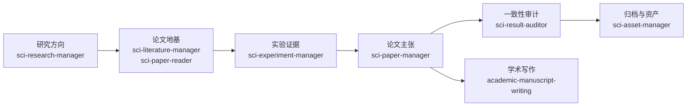

# SCI Research Codex Skills

面向长期 SCI / CVPR 研究项目的 Codex Skills。

这套技能不是为了让 Codex 只会“写一段论文”或“跑一个实验”。它的目标是把 Codex 变成一个长期研究协作助手：能记住研究方向，管理实验和论文证据，先读论文再设计实验，避免把失败路线反复调参，最后把结果沉淀成可审计、可写作、可复用的研究材料。

## 解决什么问题

长期科研项目最容易乱在几个地方：

- 方向越做越窄：本来在找新问题，最后变成调 loss、加 seed、改 head。
- 实验越做越乱：结果、配置、日志、结论散在不同文件夹里，过几天自己也找不到。
- 论文越写越虚：实验还没支持的结论，被自然地写成了“证明”。
- 文献读得不落地：读了很多论文，但没有变成变量、控制、失败标准和实验设计。
- 复盘只看涨跌：知道某条路线失败了，却不知道到底是信号错、接口错、监督错还是域外失效。

这套 skills 把研究工作拆成几个层次，让每一步都有自己的职责和边界。



## 包含哪些技能

| Skill | 主要用途 | 不负责什么 |
|---|---|---|
| `sci-research-manager` | 研究方向、阶段判断、路线纠偏、失败原因复盘、go/stop 决策 | 具体实验索引细节 |
| `sci-literature-manager` | 论文库、阅读路线、文献索引、验证队列、论文到实验的交接 | 实验结果管理 |
| `sci-paper-reader` | 中文论文精读包：问题、方法、图表、证据链、局限、项目启发 | 把论文直接当实验证据 |
| `sci-experiment-manager` | 实验 ID、实验卡、family card、索引、路径、keep/archive 决策 | 论文主张扩写 |
| `sci-paper-manager` | claim-evidence map、paper status、figure/table plan、投稿准备 | 无证据写作 |
| `sci-result-auditor` | 检查实验、主张、表格、草稿和复现信息是否一致 | 发明新方向 |
| `sci-asset-manager` | 清理候选、冷归档、提交保留清单、删除风险审查 | 研究路线决策 |
| `academic-manuscript-writing` | 英文学术段落、图表叙述、摘要/引言/讨论等论文写作 | 证据边界判断 |

## 核心工作流

### 1. 方向探索先问原因

当一个方向失败，不直接问“要不要多训几轮”，而是先问：

```text
问题是什么 -> 原因是什么 -> 方法假设是什么 -> 需要什么工具/机制
-> 如何验证 -> 结果说明什么 -> 下一个问题是什么
```

`sci-research-manager` 会强制区分几类失败原因：

- 信号不匹配：这个 cue 根本不是任务需要的 factor。
- 任务不匹配：cue 有意义，但不适合当前预测目标。
- 接口不匹配：cue 放错了决策层。
- 监督不匹配：loss/target 没表达真正现象。
- 载体不匹配：当前 detector 或 pipeline 不能自然使用这个机制。
- 真实域支持不足：合成域有信号，真实域不安全。
- 控制实验解释掉了：RGB、metadata、shuffle 或 detector-native statistics 已经解释了增益。

### 2. 文献先变成问题，不直接变成模块

论文不是“看见一个模块就插进项目里”。文献层必须先产出：

```text
hypothesis
theory
variables / cues
controls
success criteria
failure criteria
risks
do-not-do-next
```

只有当这些内容清楚后，实验层才创建 experiment ID、experiment card、config path、run path 和 result path。

### 3. 实验不是文件夹分类，而是证据链

`sci-experiment-manager` 关注低 token 检索，而不是漂亮目录。每个实验要能回答：

- 它验证了哪个假设？
- 它支持了什么？
- 它没有支持什么？
- 哪个假设被削弱或证伪？
- 下一步是继续、暂停、重定向还是停止？

探索路线可以用 family card 收束，避免几十个子实验都堆在 active 文件夹里。

### 4. 论文主张必须有证据边界

`sci-paper-manager` 要求每个 claim 都进入 `CLAIM_EVIDENCE_MAP.md`。

如果证据不足，就标记：

- `unsupported`
- `needs verification`
- `trend_only`
- `diagnostic_only`
- `negative_boundary`
- `internal_exploration`

这样可以防止把一个内部探索结果写成正式论文贡献。

## 推荐项目结构

```text
PROJECT_HANDOFF.md
AGENTS.md
research_workspace/
  experiments/
    QUERY_MAP.md
    EXPERIMENT_INDEX.md
    EXPERIMENT_INDEX.csv
    cards/
  literature/
    indexes/
    paper_packets/
    reading_routes/
  paper/
    PAPER_STATUS.md
    CLAIM_EVIDENCE_MAP.md
    FIGURE_PLAN.md
    TABLE_PLAN.md
  project/
    DECISION_LOG.md
    STAGE_PLAN.md
    PROJECT_PLAN.md
```

## 安装

克隆仓库：

```bash
git clone https://github.com/godzhiwzz-create/sci-research-codex-skills.git
```

安装全部技能：

```bash
mkdir -p ~/.codex/skills
cp -R sci-research-codex-skills/skills/* ~/.codex/skills/
```

只安装核心研究流：

```bash
mkdir -p ~/.codex/skills
cp -R sci-research-codex-skills/skills/sci-research-manager ~/.codex/skills/
cp -R sci-research-codex-skills/skills/sci-literature-manager ~/.codex/skills/
cp -R sci-research-codex-skills/skills/sci-paper-reader ~/.codex/skills/
cp -R sci-research-codex-skills/skills/sci-experiment-manager ~/.codex/skills/
cp -R sci-research-codex-skills/skills/sci-paper-manager ~/.codex/skills/
cp -R sci-research-codex-skills/skills/sci-result-auditor ~/.codex/skills/
```

复制后重启 Codex 或重新加载 skills。

## 快速开始

### 1. 建立研究工作区

在你的研究项目根目录下：

```bash
mkdir -p research_workspace/experiments/cards
mkdir -p research_workspace/literature
mkdir -p research_workspace/paper
mkdir -p research_workspace/project
```

复制基础模板：

```bash
cp ~/.codex/skills/sci-research-manager/templates/PROJECT_HANDOFF.md .
cp ~/.codex/skills/sci-research-manager/templates/DECISION_LOG.md research_workspace/project/
cp ~/.codex/skills/sci-research-manager/templates/STAGE_PLAN.md research_workspace/project/
cp ~/.codex/skills/sci-experiment-manager/templates/QUERY_MAP.md research_workspace/experiments/
cp ~/.codex/skills/sci-experiment-manager/templates/EXPERIMENT_INDEX.md research_workspace/experiments/
cp ~/.codex/skills/sci-experiment-manager/templates/EXPERIMENT_INDEX.csv research_workspace/experiments/
cp ~/.codex/skills/sci-paper-manager/templates/PAPER_STATUS.md research_workspace/paper/
cp ~/.codex/skills/sci-paper-manager/templates/CLAIM_EVIDENCE_MAP.md research_workspace/paper/
```

### 2. 给 Codex 写项目规则

在项目根目录创建 `AGENTS.md`，可以从这个最小版本开始：

```markdown
# AGENTS.md

Before starting a research task, read:

1. PROJECT_HANDOFF.md
2. research_workspace/experiments/QUERY_MAP.md
3. research_workspace/experiments/EXPERIMENT_INDEX.md
4. relevant experiment cards only

Classify each task as:
idea_exploration, minimal_probe, formal_experiment, result_analysis,
paper_writing, submission_prepare, or maintenance.

Do not invent results, metrics, citations, or conclusions.
Every paper claim must be supported by CLAIM_EVIDENCE_MAP.md.
```

### 3. 初始化项目记忆

对 Codex 说：

```text
Use sci-research-manager. Initialize the project memory files for my new SCI paper project. Keep uncertain details marked as uncertain.
```

### 4. 从论文地基开始

当机制还不清楚时：

```text
Use sci-literature-manager and sci-paper-reader. Build a paper-first reading route for this research problem. Do not design experiments until the papers produce a hypothesis, variables, controls, success criteria, failure criteria, and do-not-do-next list.
```

当你想快速读懂一篇论文时：

```text
Use sci-paper-reader. Create a Chinese paper-understanding packet with abstract interpretation, method route, figure/table explanations, evidence spine, limitations, relation to other papers, and a dated project attachment at the end.
```

### 5. 创建实验卡

```bash
python ~/.codex/skills/sci-experiment-manager/scripts/generate_experiment_card.py E001 "baseline experiment"
```

然后让 Codex 补全真实信息：

```text
Use sci-experiment-manager. Update E001 with the real config path, run path, result path, status, paper role, tags, and one-line summary. Do not invent missing metrics.
```

### 6. 写作前先做证据映射

```text
Use sci-paper-manager. Add the supported claims to CLAIM_EVIDENCE_MAP.md and mark unsupported claims as needs verification.
```

### 7. 投稿或大改前做审计

```bash
python ~/.codex/skills/sci-result-auditor/scripts/check_project_consistency.py
```

然后：

```text
Use sci-result-auditor. Review the generated consistency report and tell me which claims, experiment cards, or index rows need repair before I write the paper.
```

## 典型使用场景

### 新方向来了

先用 `sci-research-manager` 做方向探索，不直接训练。

输出应包含：

- 问题是什么；
- 为什么现有路线不够；
- 新假设是什么；
- 需要哪些文献；
- 最小验证是什么；
- 成功/失败标准是什么；
- 哪些事下一步不能做。

### 一堆实验乱了

用 `sci-experiment-manager` 合并成 family card：

- active 目录只保留一个可读的路线文件；
- 子实验进入 archive 或 merge manifest；
- index 指向 canonical card；
- 原始路径和证据 trail 保留。

### 论文要写了

用 `sci-paper-manager` 固定 claim-evidence map，再用 `academic-manuscript-writing` 写段落。

不要反过来：先写漂亮句子，再找证据补。

### 要清理文件

用 `sci-asset-manager` 做 delete review / cold archive manifest。

不要直接删实验元数据。

## 隐私与发布检查

如果你把使用这些 skills 的项目公开，请先检查：

- API key、token、SSH key、`.env`、私钥文件；
- 个人姓名、邮箱、电话、私有服务器地址、本地绝对路径；
- 私有数据集路径、未公开日志、checkpoint、完整 metric 表；
- 含未支持结论的论文草稿、审稿意见、目标期刊受限模板；
- 大二进制文件、缓存、`.DS_Store`、`__pycache__`、`.pytest_cache`。

本仓库只提供通用 workflow 与模板。你的项目记忆文件可能包含私有研究证据，需要单独审查。

## 设计原则

- 先找原因，再做实验。
- 先读论文，再定变量。
- 先建证据链，再写论文。
- 失败要归档原因，不只归档结果。
- 强框架可以做参考，但不要自动变成你的贡献。
- 任何漂亮结论都必须能回到实验卡和 claim-evidence map。

## License

MIT License. See [LICENSE](LICENSE).
