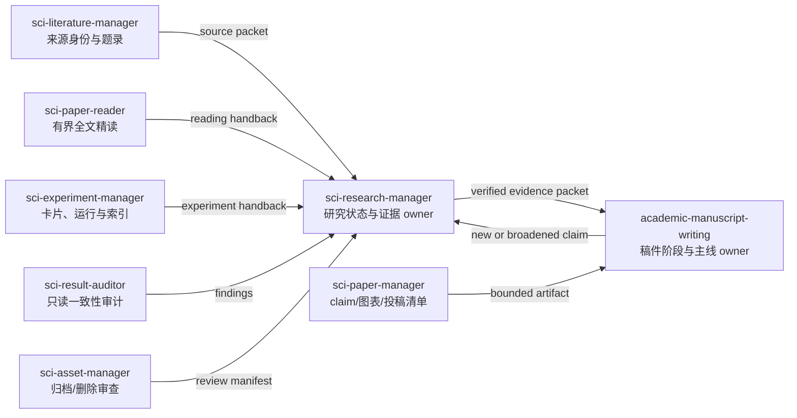

# SCI Research Codex Skills

[](https://github.com/godzhiwzz-create/sci-research-codex-skills/releases)
[](https://github.com/godzhiwzz-create/sci-research-codex-skills/actions/workflows/tests.yml)
[](https://godzhiwzz-create.github.io/sci-research-codex-skills/)
[](LICENSE)

面向长期、证据驱动科研项目的 Codex Skills。当前版本：**2.0.0**。

这套系统让 Codex 不只会“写一段论文”或“跑一个实验”，而是能在跨会话、跨阶段的研究中保存方向、追溯证据、约束 claim、保护工作区，并把专门任务路由给合适的 Skill。

> 稳定版：[v2.0.0](https://github.com/godzhiwzz-create/sci-research-codex-skills/releases/tag/v2.0.0) · 历史基线：[v1.0.0](https://github.com/godzhiwzz-create/sci-research-codex-skills/releases/tag/v1.0.0) · [在线教程](https://godzhiwzz-create.github.io/sci-research-codex-skills/)

## v2 的核心变化

- 保留仓库名和全部 8 个原有 Skill 名称。
- 将 `sci-research-manager` 升级为统一科研生命周期中枢。
- 收敛阶段、实验状态、证据状态、claim 强度和方向决策，避免状态词漂移。
- 去除写死的 `research_workspace/`、teacher/student、特定数据集和特定研究方向假设。
- 新增工作区只读审计、文件时间/provenance 保护、E/F 实验卡生成、双格式索引和通用一致性审计。
- 为全部 Skill 补齐 `agents/openai.yaml`。
- 新增零第三方依赖的自动化测试和 GitHub Actions。

## main 分支的 Unreleased 升级

- 保留 8 个公开 Skill ID，把 `sci-research-manager` 和 `academic-manuscript-writing` 分别强化为研究状态 owner 与稿件生命周期 owner。
- 新增项目文献 Source-ID/LiteratureClaim 接口、实验五轴当前状态、证据晋升/替代门，以及 literature-to-experiment 和 evidence-to-manuscript 两个交接门。
- 新增 7 个稿件阶段，区分初稿、成稿打磨、提交前只读审核、大修、小修、最终提交审核和校样纠正。
- 专门 Skill 改为接收有界输入并返回 typed handback，不直接扩大研究状态、claim 或稿件主线。
- 新增可配置的研究库结构审计和对外材料披露候选扫描；扫描不完整会明确阻断，干净扫描也不等于作者批准。
- 按讨论、定向查新、最小探索、正式实验和投稿审计选择流程强度；复用未变上下文，已知论文增量入库，最近先例先于为提案投入准备工作。
- 通过 SSH 连接用户自行配置的服务器；一个任务一个监控负责人，区分本地连接退出与远端任务结束。公开内容不包含服务器配置、个人路径或研究项目记录。

这些规则旨在减少重复读取、无效等待和重复建档，不减少决定性证据核验。尚未通过可比真实任务量化 token 或额度节省。

这些变化已记入 [CHANGELOG 的 Unreleased](CHANGELOG.md)。当前稳定 Release 仍是 `v2.0.0`；后续发布将通过独立版本 PR 完成。

## 版本与维护

- [MAINTENANCE](MAINTENANCE.md)：日常更新、版本发布、定期巡检、回滚与交接的唯一流程入口。
- [Releases](https://github.com/godzhiwzz-create/sci-research-codex-skills/releases)：下载稳定快照并查看发布说明。
- [CHANGELOG](CHANGELOG.md)：查看版本间的行为、兼容性和维护变化。
- [CONTRIBUTING](CONTRIBUTING.md)：提交问题、改进 Skill 或脚本前先阅读。
- [CODE OF CONDUCT](CODE_OF_CONDUCT.md)：参与 Issue、Pull Request 和评审时遵守科研协作与数据保护边界。
- [SECURITY](SECURITY.md)：涉及路径越界、覆盖、凭据泄露或未授权远程执行时使用私密报告渠道。
- [Issues](https://github.com/godzhiwzz-create/sci-research-codex-skills/issues)：报告可公开复现的问题或提出功能请求。

`v1.0.0` 是 v2 合并前的不可移动历史标签；`v2.0.0` 是当前稳定快照，`main` 还包含 Changelog 中的 Unreleased 变化。仓库遵循语义化版本，已发布标签不重写、不复用。

## 设计原则

1. **事实高于会话记忆**：原始结果、配置、commit 和冻结协议优先于实验卡、HANDOFF 和聊天摘要。
2. **文献不是项目证据**：论文可以产生假设，不能替代项目实验。
3. **先问题，后投入**：先检查最近先例与竞争解释，再选最小有效验证；不盲目调参，也不要求完整因果证明才允许有价值的小实验。
4. **claim 必须可追溯**：每个论文主张都要对应兼容协议下的证据。
5. **维护默认只读**：整理不自动删除、移动、提交、推送或重写原始资产时间。
6. **低上下文检索**：先 HANDOFF、QUERY_MAP、索引，再读卡片和原始文件。
7. **一个事实一个 owner**：研究状态与证据由生命周期中枢集成，稿件阶段与主线由写作入口集成，专门 Skill 只返回有界产物。

## 系统结构


```mermaid
flowchart LR
  B["sci-literature-manager<br/>来源身份与题录"] -->|source packet| A["sci-research-manager<br/>研究状态与证据 owner"]
  C["sci-paper-reader<br/>有界全文精读"] -->|reading handback| A
  D["sci-experiment-manager<br/>卡片、运行与索引"] -->|experiment handback| A
  E["sci-result-auditor<br/>只读一致性审计"] -->|findings| A
  H["sci-asset-manager<br/>归档/删除审查"] -->|review manifest| A
  A -->|verified evidence packet| G["academic-manuscript-writing<br/>稿件阶段与主线 owner"]
  F["sci-paper-manager<br/>claim/图表/投稿清单"] -->|bounded artifact| G
  G -->|new or broadened claim| A
```

`sci-research-manager` 负责研究状态、方向、证据边界、跨库交接和最终提交门；`academic-manuscript-writing` 负责稿件阶段、主线、正文、修订与回复。其余 6 个 Skill 返回有界产物。项目自己的 `AGENTS.md`、schema 和事实来源始终优先。

## 8 个原有 Skill

| Skill | 负责 | 不负责 |
|---|---|---|
| `sci-research-manager` | 研究状态、项目文献接口、实验语义、证据晋升、方向决策、最终提交门 | 代替内容专门 Skill |
| `academic-manuscript-writing` | 稿件阶段、主线、正文、修订、回复信、clean/marked-up 与 proof 内容 | 晋升证据或执行最终提交 |
| `sci-literature-manager` | 全局来源身份、题录、版本、去重、BibTeX 与 source packet | 把文献当项目实验结果或直接改项目 claim |
| `sci-paper-reader` | 源材料驱动的有界理解包和图表 proof cards | 创建项目实验结果或决定方向 |
| `sci-experiment-manager` | E/F 编号、冻结协议、卡片、运行记录、项目索引 | 自行晋升证据或改变项目路线 |
| `sci-result-auditor` | 只读证据、协议、claim 和文件一致性发现 | 静默修复证据或作第二套路线决策 |
| `sci-paper-manager` | claim map、paper status、图表计划、要求缓存、投稿清单 | 改写稿件主线或决定最终 readiness |
| `sci-asset-manager` | 迁移/归档/删除风险审查与 manifest | 未授权删除或移动 |

## 安装

克隆仓库：

```bash
git clone https://github.com/godzhiwzz-create/sci-research-codex-skills.git
cd sci-research-codex-skills
```

需要可复现稳定版时执行 `git switch --detach v2.0.0`；需要已通过主分支 CI、但尚未形成新 Release 的最新能力时保持在 `main`。

安装全部 Skill：

```bash
mkdir -p ~/.codex/skills
cp -R skills/* ~/.codex/skills/
```

只安装生命周期中枢：

```bash
cp -R skills/sci-research-manager ~/.codex/skills/
```

升级已有安装前先备份本地自定义内容，再用同名目录覆盖；v2 沿用全部原名称，不要求迁移触发词。

安装或升级后重新加载 Codex Skill 列表。

## 快速开始

恢复长期项目：

```text
Use $sci-research-manager to resume this project.
Read the lightest authoritative context, separate verified evidence from session-only memory,
and tell me the blocker and safest next action.
```

建立实验记录：

```text
Use $sci-experiment-manager to create F120-D01.
Freeze the protocol, controls, promotion gate, stop gate, paths, and claim boundary before execution.
```

投稿前审计：

```text
Use $sci-result-auditor to audit the manuscript, result registry, claim map,
public code, and protocol consistency without modifying source evidence.
```

阶段化写作或修订：

```text
Use $academic-manuscript-writing to identify the manuscript stage first.
Preserve the canonical mainline and evidence scope, then return the stage artifacts,
checks, unresolved blockers, and only valid next stages.
```

## 推荐项目入口

Skill 不强制一个物理目录。已有项目应沿用自己的结构；新项目可从下面的职责分层开始：

```text
AGENTS.md                  # Agent 行为和读写边界
README.md                  # 项目入口与所有权
HANDOFF.md                 # 当前状态、证据、blocker、下一动作
SESSION_MEMORY.md          # 稳定跨会话认知；不替代原始证据
experiments/
  QUERY_MAP.md
  EXPERIMENTS.tsv            # 新项目推荐的五轴当前状态机器源
  EXPERIMENT_INDEX.csv       # 旧项目可保留为 authority 或 generated view，二选一
  cards/
paper/
  PAPER_STATUS.md
  CLAIM_EVIDENCE_MAP.md
literature/
  SOURCES.tsv                # 项目 Source-ID、标签、角色与 reading depth
  LITERATURE_CLAIMS.tsv      # 精确外部 claim 的核验状态
  QUERY_MAP.md
```

旧版 `PROJECT_HANDOFF.md` 和 `research_workspace/` 继续兼容，但不再是硬编码前提。

## 内置工具

| 工具 | 作用 | 默认安全边界 |
|---|---|---|
| `sci-research-manager/scripts/audit_workspace.py` | 检查入口、Markdown 本地链接、软链接和嵌套 Git 状态 | 只读 |
| `sci-research-manager/scripts/provenance_guard.py` | 记录/核验 size、mtime、symlink target、可选 SHA-256 | 不改原资产 |
| `sci-research-manager/scripts/audit_research_libraries.py` | 检查 Source ID、LiteratureClaim、实验五轴索引和 canonical registry | 只读；路径按 workspace 相对输出，支持显式目录、vocabulary 扩展和 canonical 语义映射 |
| `sci-research-manager/scripts/scan_external_disclosures.py` | 扫描文本、OOXML/ODF、PDF、图片和压缩包中的披露候选 | 默认隐藏输入根；`0` 干净、`1` 候选、`2` 不完整；仍需人工审核 |
| `sci-experiment-manager/scripts/generate_experiment_card.py` | 创建 E/F 卡片 | 拒绝覆盖 |
| `sci-experiment-manager/scripts/update_experiment_index.py` | 生成 Markdown/CSV 索引 | 只写 `.generated.*` |
| `sci-experiment-manager/scripts/collect_results.py` | 汇总 `results.csv` | 只写 generated 表 |
| `sci-result-auditor/scripts/check_project_consistency.py` | 核对 ID、卡片、raw path、claim map 和 handoff | 默认 stdout，只读 |
| `sci-paper-reader/scripts/check_html_assets.py` | 检查本地视觉资产 | 只读 |

所有脚本支持 `--help`。在非标准项目中显式传入 root、目录和输出路径。

## 测试

本地运行：

```bash
python scripts/maintenance_check.py check
python -m unittest discover -s tests -v
```

测试覆盖：

- VERSION、Changelog、README、Pages、CI、社区文件和公开 Skill 的维护一致性；
- 8 个 Skill 的 frontmatter、名称、长度、引用和 UI 元数据；
- Markdown/HTML 本地链接；
- 工作区审计的正常与故障路径；
- 研究库默认/非标准布局、五轴 vocabulary 扩展及 PASS/WARN/FAIL/INCOMPLETE 退出码；
- 披露扫描的文本、OOXML、嵌套压缩包、未支持格式与软链接边界；
- provenance 快照、mtime/hash/软链接和越界保护；
- E/F 卡片生成、不覆盖、索引、结果汇总；
- claim/index/card/raw-result 一致性；
- HTML 本地资产检查。

GitHub Actions 在 Python 3.10、3.11 和 3.13 上运行同一测试集。
每月只读巡检会重复运行维护检查、测试和当前稳定标签核验；Dependabot 每月检查 GitHub Actions 更新。

## 教程与演示

- [教程导航](docs/tutorials/README.md)
- [项目管理教程](docs/tutorials/project-management.md)
- [论文精读教程](docs/tutorials/paper-deepread.md)
- [Attention Is All You Need 精读演示](docs/tutorials/examples/attention-is-all-you-need/README.md)
- [GitHub Pages](https://godzhiwzz-create.github.io/sci-research-codex-skills/)

## 兼容策略

- 仓库名和 8 个 Skill 文件夹名保持不变。
- 旧模板和 `research_workspace/` 路径仍可读；新脚本允许显式配置路径。
- `EXPERIMENTS.tsv` 是新项目推荐的五轴机器源；旧 `EXPERIMENT_INDEX.*` 保留，但必须明确唯一 editable authority。
- 默认状态词统一为 `partial/stopped` 与 `not_assessed/pending_artifact/unverifiable` 等五轴语义；已有项目 schema 不强制批量改名，可显式扩展审计词表；会影响 completion/verification/claim gate 的别名需用 `--map-value FIELD=ALIAS:CANONICAL` 声明语义。
- 旧写作 reference 路径保留为指向阶段化规范的兼容入口。
- 生成器不自动覆盖人工维护的 canonical 文件。
- 重大行为变化先经过结构测试、脚本测试和独立只读前向测试。

## License

MIT，见 [LICENSE](LICENSE)。
