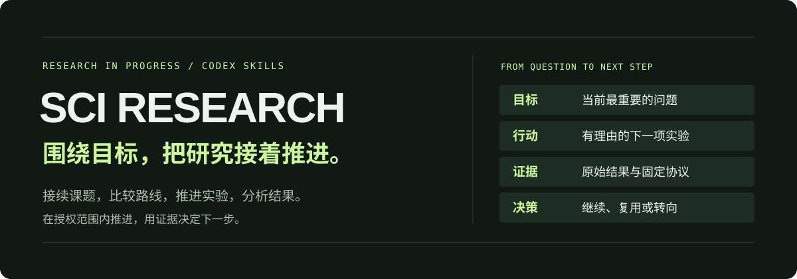
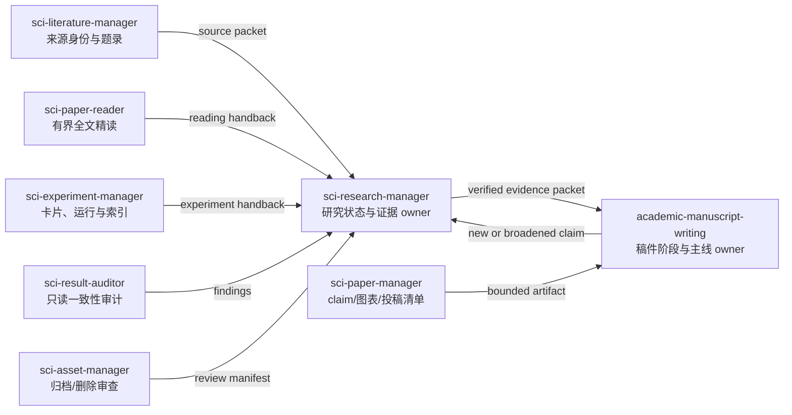

# SCI Research Codex Skills

[](https://godzhiwzz-create.github.io/sci-research-codex-skills/)

[](LICENSE)

**围绕一个目标，把研究接着推进。**

从个人科研实践中整理的开源 Codex Skills。核心是让 Codex 接续一个研究项目：理解目标、比较假设与路线、设计和推进实验、核对结果，再根据证据选择下一步。文献检索、论文精读、实验记录与写作，是支撑这条研究主线的不同能力。

你决定目标、重大取舍与授权范围；研究负责人在这个范围内承担具体研究判断与推进。持续执行还需要可用的运行环境，安装 Skill 不会自动开启后台任务。

沿用已有的项目、目录和资料，不要求搬迁知识库，也不需要同时调用全部 8 个 Skill。

> **[浏览项目主页 ↗](https://godzhiwzz-create.github.io/sci-research-codex-skills/)** · [研究怎样接着推进](#研究怎样接着推进) · [安装](#安装) · [快速开始](#快速开始) · [中文教程](docs/tutorials/README.md)

## 研究怎样接着推进

1. **接续课题**：从已有项目找回研究目标、当前假设、证据与卡点。
2. **比较路线**：结合最近先例和竞争解释，给出有理由的方法选择。
3. **推进实验**：明确实验要改变哪项判断，固定协议与对照，在授权内执行和跟踪。
4. **根据结果决策**：核对原始证据，区分科学结果和工程故障，决定继续、复用、转向或停止。
5. **接续状态与写作**：只更新变化的记录，把可用证据交给稿件流程，下一次继续当前问题。

这是随证据迭代的研究过程，不是每次必须从头执行的清单。[项目接续与决策说明](docs/tutorials/project-management.md)介绍了具体用法。

## 从你的任务开始

| 你正在遇到的问题 | 使用入口 | 你会得到什么 |
|---|---|---|
| 围绕这个目标，把研究接着推进 | [sci-research-manager](skills/sci-research-manager/SKILL.md) | 研究判断、已授权工作推进、结果决策与项目接续 |
| 有没有相关工作？这篇论文是否已入库？ | [sci-literature-manager](skills/sci-literature-manager/SKILL.md) | 来源清单、身份核验、去重与引用信息 |
| 这篇论文的方法和关键图表怎么理解？ | [sci-paper-reader](skills/sci-paper-reader/SKILL.md) | 有原文定位的解释；完整图文理解包按需生成 |
| 这次实验回答什么，结果保存在哪里？ | [sci-experiment-manager](skills/sci-experiment-manager/SKILL.md) | 假设、固定协议、实验卡与原始结果入口 |
| 这个数字和结论能写进论文吗？ | [sci-result-auditor](skills/sci-result-auditor/SKILL.md) | 协议与证据核对、冲突项及结论边界 |
| 怎样组织论文主线、改稿和回复审稿人？ | [academic-manuscript-writing](skills/academic-manuscript-writing/SKILL.md) | 对应稿件阶段的正文、修订稿或逐条回复 |

其余两个 Skill 负责[论文配套清单](skills/sci-paper-manager/SKILL.md)与[资产维护审查](skills/sci-asset-manager/SKILL.md)。不必同时调用全部 8 个。

## 如何配合你的研究

- **讨论时**：围绕当前问题查证与比较，不自动启动下载或实验。
- **实验时**：在授权范围内连接假设、协议、原始结果和后续判断。
- **写作时**：围绕已有证据起草、打磨或修订，保持主线和结论范围。
- **接续项目时**：通过现有文件找回问题、证据和下一步，不依赖聊天记忆。

关键研究判断仍需核对原始证据，不能保证创新、实验成功或论文录用。重要取舍与对外提交由你决定。

<details>
<summary>了解模块分工与证据保障</summary>

### 设计原则

1. **事实高于会话记忆**：原始结果、配置、commit 和冻结协议优先于实验卡、HANDOFF 和聊天摘要。
2. **文献不是项目证据**：论文可以产生假设，不能替代项目实验。
3. **先问题，后投入**：先检查最近先例与竞争解释，再选最小有效验证；不盲目调参，也不要求完整因果证明才允许有价值的小实验。
4. **claim 必须可追溯**：每个论文主张都要对应兼容协议下的证据。
5. **维护默认只读**：整理不自动删除、移动、提交、推送或重写原始资产时间。
6. **低上下文检索**：入口和索引用于定位；复用未变上下文，窄问题直接查决定性证据，不固定重读顺序。
7. **一个事实一个 owner**：研究状态与证据由生命周期中枢集成，稿件阶段与主线由写作入口集成。owner 是职责，不要求额外代理；窄任务可从专门 Skill 直接完成。

### 系统结构


```mermaid
flowchart LR
  B["sci-literature-manager<br/>来源身份与题录"] -->|source packet| A["sci-research-manager<br/>研究状态与证据 owner"]
  C["sci-paper-reader<br/>有界全文精读"] -->|reading handback| A
  D["sci-experiment-manager<br/>卡片、运行与索引"] -->|experiment handback| A
  E["sci-result-auditor<br/>只读一致性审计"] -->|findings| A
  H["sci-asset-manager<br/>归档/删除审查"] -->|review manifest| A
  A -->|verified evidence packet| G["academic-manuscript-writing<br/>稿件阶段与主线 owner"]
  F["sci-paper-manager<br/>claim/图表/投稿清单"] -->|bounded artifact| G
  G -->|new or broadened claim| A
```

`sci-research-manager` 负责研究状态、方向、证据边界、跨库交接和最终提交门；`academic-manuscript-writing` 负责稿件阶段、主线、正文、修订与回复。其余 6 个 Skill 返回有界产物。项目自己的 `AGENTS.md`、schema 和事实来源始终优先。

图中箭头表示需要集成时的数据流，不是每次必走的执行链。局部编辑不自动触发全稿审核，文件清单不等于提交就绪；可选模块不可用时保留验证与权限边界，说明具体缺口。

### 8 个 Skill 的职责

| Skill | 负责 | 不负责 |
|---|---|---|
| `sci-research-manager` | 研究状态、项目文献接口、实验语义、证据晋升、方向决策、最终提交门 | 代替内容专门 Skill |
| `academic-manuscript-writing` | 稿件阶段、主线、正文、修订、回复信、clean/marked-up 与 proof 内容 | 晋升证据或执行最终提交 |
| `sci-literature-manager` | 全局来源身份、题录、版本、去重、BibTeX 与 source packet | 把文献当项目实验结果或直接改项目 claim |
| `sci-paper-reader` | 源材料驱动的有界理解包和图表 proof cards | 创建项目实验结果或决定方向 |
| `sci-experiment-manager` | E/F 编号、冻结协议、卡片、运行记录、项目索引 | 自行晋升证据或改变项目路线 |
| `sci-result-auditor` | 只读证据、协议、claim 和文件一致性发现 | 静默修复证据或作第二套路线决策 |
| `sci-paper-manager` | claim map、paper status、图表计划、要求缓存、投稿清单 | 改写稿件主线或决定最终 readiness |
| `sci-asset-manager` | 迁移/归档/删除风险审查与 manifest | 未授权删除或移动 |

</details>

## 安装

克隆仓库：

```bash
git clone https://github.com/godzhiwzz-create/sci-research-codex-skills.git
cd sci-research-codex-skills
```

下面的安全安装器需要 Python 3.10+，无第三方依赖，也不联网。以下命令使用仓库默认分支；需要固定快照时，按[发布记录](https://github.com/godzhiwzz-create/sci-research-codex-skills/releases)选择，并使用该快照自带的安装说明。

先预览，再安装选定 Skill：

```bash
python3 scripts/install_skills.py --skill sci-research-manager
python3 scripts/install_skills.py --skill sci-research-manager --apply
```

安装或升级后重新加载 Codex Skill 列表，然后用下面的中文示例开始。

<details>
<summary>更多安装选项：全部安装、升级、备份与恢复</summary>

也可以选择全部，或显式升级：

```bash
python3 scripts/install_skills.py --all
python3 scripts/install_skills.py --all --apply
python3 scripts/install_skills.py --skill sci-research-manager --upgrade
python3 scripts/install_skills.py --skill sci-research-manager --upgrade --apply
```

不加 `--apply` 不写文件。默认目标为 `$CODEX_HOME/skills`（未配置则使用 `~/.codex/skills`）；可用 `--destination PATH` 指定其他专用目录。相同内容跳过；已有不同内容默认拒绝，只有显式 `--upgrade` 才替换，并将整个旧目录移入同级 `skill-backups/唯一批次/`，保留自定义文件与原文件时间。备份不会被当作 Skill 加载；可用 `--backup-dir PATH` 指定同文件系统、安装目录外的备份根。

升级是有备份的替换，不自动合并本地定制。安装器先检查全部选项，再暂存并切换；普通切换失败会尝试回滚，备份不自动删除。请在没有其他编辑/安装进程时使用；锁和状态复核不能防御任意外部并发修改或系统中断。中断后先检查输出的备份/暂存位置再恢复，不盲目删除锁。软链接和特殊文件会被拒绝。

</details>

## 快速开始

接续项目，并推进已有授权内的研究：

```text
用 $sci-research-manager 接续这个项目。
根据当前研究目标与已有证据，比较可行路线，在已有授权内推进下一步，
并根据结果更新判断。超出授权时带着具体方案找我。
```

讨论一个方向，不启动执行：

```text
用 $sci-research-manager 讨论我接下来描述的研究想法。
先回答问题，不建档、不启动下载或远端任务。
如果新颖性或可行性会影响判断，先核对最接近的原始论文。
```

给已知论文入库：

```text
用 $sci-literature-manager 将我提供 DOI 的论文入库。
先查重和核对版本，只补充缺失信息；不重做全领域检索或完整精读。
```

恢复长期项目：

```text
用 $sci-research-manager 接续这个项目。
从现有入口找到当前问题和必要证据，区分已核验事实与会话记忆，
告诉我卡在哪里，以及最值得做的下一步。
```

建立实验记录：

```text
用 $sci-experiment-manager 为我确认的实验建立记录。
写清假设、固定协议、对照、成功与停止条件、结果路径和结论边界。
这次只建立记录，不启动实验。
```

投稿前审计：

```text
用 $sci-result-auditor 核对稿件、结果登记、主张与证据映射、
公开代码和协议的一致性。只报告发现，不修改原始证据。
```

阶段化写作或修订：

```text
用 $academic-manuscript-writing 处理我提供的稿件。
先确定当前是起草、打磨还是审稿修订；保留主线与证据边界，
完成当前任务，并指出仍需我处理的问题。
```

## 推荐项目入口

Skill 不强制一个物理目录。已有项目应沿用自己的结构；新项目可从下面的职责分层开始：

```text
AGENTS.md                  # Agent 行为和读写边界
README.md                  # 项目入口与所有权
HANDOFF.md                 # 当前状态、证据、blocker、下一动作
SESSION_MEMORY.md          # 稳定跨会话认知；不替代原始证据
experiments/
  QUERY_MAP.md
  EXPERIMENTS.tsv            # 新项目推荐的五轴当前状态机器源
  EXPERIMENT_INDEX.csv       # 旧项目可保留为 authority 或 generated view，二选一
  cards/
paper/
  PAPER_STATUS.md
  CLAIM_EVIDENCE_MAP.md
literature/
  SOURCES.tsv                # 项目 Source-ID、标签、角色与 reading depth
  LITERATURE_CLAIMS.tsv      # 精确外部 claim 的核验状态
  QUERY_MAP.md
```

旧版 `PROJECT_HANDOFF.md` 和 `research_workspace/` 继续兼容，但不再是硬编码前提。

## 内置工具

| 工具 | 作用 | 默认安全边界 |
|---|---|---|
| `scripts/install_skills.py`（仓库根） | 选择安装或有备份升级 | 默认预览，显式 `--apply` 才写入 |
| `sci-research-manager/scripts/audit_workspace.py` | 检查入口、Markdown 本地链接、软链接和嵌套 Git 状态 | 只读 |
| `sci-research-manager/scripts/provenance_guard.py` | 记录/核验 size、mtime、symlink target、可选 SHA-256 | 不改原资产 |
| `sci-research-manager/scripts/audit_research_libraries.py` | 检查 Source ID、LiteratureClaim、实验五轴索引和 canonical registry | 只读；路径按 workspace 相对输出，支持显式目录、vocabulary 扩展和 canonical 语义映射 |
| `sci-research-manager/scripts/scan_external_disclosures.py` | 扫描文本、OOXML/ODF、PDF、图片和压缩包中的披露候选 | 默认隐藏输入根；`0` 干净、`1` 候选、`2` 不完整；仍需人工审核 |
| `sci-experiment-manager/scripts/generate_experiment_card.py` | 创建 E/F 卡片 | 拒绝覆盖 |
| `sci-experiment-manager/scripts/update_experiment_index.py` | 生成 Markdown/CSV 索引 | 只写 `.generated.*` |
| `sci-experiment-manager/scripts/collect_results.py` | 汇总 `results.csv` | 只写 generated 表 |
| `sci-result-auditor/scripts/check_project_consistency.py` | 核对 ID、卡片、raw path、claim map 和 handoff | 默认 stdout，只读 |
| `sci-paper-reader/scripts/check_html_assets.py` | 检查本地视觉资产 | 只读 |

所有脚本支持 `--help`。在非标准项目中显式传入 root、目录和输出路径。

## 测试

本地运行：

```bash
python scripts/maintenance_check.py check
python -m unittest discover -s tests -v
```

测试覆盖：

- VERSION、Changelog、标签的发布一致性，以及 README、Pages、CI、社区文件和公开 Skill 的维护检查；
- 8 个 Skill 的 frontmatter、名称、长度、引用和 UI 元数据；
- Markdown/HTML 本地链接；
- 工作区审计的正常与故障路径；
- 研究库默认/非标准布局、五轴 vocabulary 扩展及 PASS/WARN/FAIL/INCOMPLETE 退出码；
- 披露扫描的文本、OOXML、嵌套压缩包、未支持格式与软链接边界；
- provenance 快照、mtime/hash/软链接和越界保护；
- E/F 卡片生成、不覆盖、索引、结果汇总；
- claim/index/card/raw-result 一致性；
- HTML 本地资产检查。

GitHub Actions 在 Python 3.10、3.11 和 3.13 上运行同一测试集。
每月只读巡检会重复运行维护检查、测试和当前稳定标签核验；Dependabot 每月检查 GitHub Actions 更新。

## 教程与演示

- [教程导航](docs/tutorials/README.md)
- [项目管理教程](docs/tutorials/project-management.md)
- [论文精读教程](docs/tutorials/paper-deepread.md)
- [论文精读子模块示例：Attention Is All You Need](docs/tutorials/examples/attention-is-all-you-need/README.md)——仅展示阅读任务，不代表完整科研推进流程。
- [GitHub Pages](https://godzhiwzz-create.github.io/sci-research-codex-skills/)

## 兼容策略

- 仓库名和 8 个 Skill 文件夹名保持不变。
- 旧模板和 `research_workspace/` 路径仍可读；新脚本允许显式配置路径。
- `EXPERIMENTS.tsv` 是新项目推荐的五轴机器源；旧 `EXPERIMENT_INDEX.*` 保留，但必须明确唯一 editable authority。
- 默认状态词统一为 `partial/stopped` 与 `not_assessed/pending_artifact/unverifiable` 等五轴语义；已有项目 schema 不强制批量改名，可显式扩展审计词表；会影响 completion/verification/claim gate 的别名需用 `--map-value FIELD=ALIAS:CANONICAL` 声明语义。
- 旧写作 reference 路径保留为指向阶段化规范的兼容入口。
- 生成器不自动覆盖人工维护的 canonical 文件。
- 重大行为变化先经过结构测试、脚本测试和独立只读前向测试。

## License

MIT，见 [LICENSE](LICENSE)。

## 参与与维护

[贡献指南](CONTRIBUTING.md) · [报告问题](https://github.com/godzhiwzz-create/sci-research-codex-skills/issues) · [行为准则](CODE_OF_CONDUCT.md) · [安全反馈](SECURITY.md) · [维护文档](MAINTENANCE.md) · [Changelog](CHANGELOG.md)
