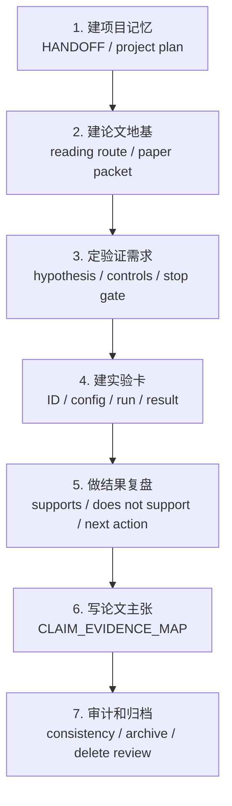

# 教程导航

这页是 `sci-research-codex-skills` v2 的使用入口。它不是 API 文档，而是告诉你：什么时候该用哪一个 Skill，输出应该长什么样，如何避免把研究项目越做越乱。v2 继续沿用全部原名称，由 `sci-research-manager` 统一生命周期和证据边界。

在线渲染版入口：

- [GitHub Pages 教程首页](https://godzhiwzz-create.github.io/sci-research-codex-skills/tutorials/)
- [Attention Is All You Need 精读 HTML 演示](https://godzhiwzz-create.github.io/sci-research-codex-skills/tutorials/examples/attention-is-all-you-need/)
- [v2 架构与兼容说明](../architecture-v2.md)

## 你现在遇到的情况

| 你遇到的问题 | 先用哪个 skill | 看哪个教程 |
|---|---|---|
| 项目文件乱，实验太多，看不懂主线 | `sci-research-manager` + `sci-experiment-manager` | [项目管理教程](project-management.md) |
| 想快速读懂一篇论文，还要有图表和证据线 | `sci-literature-manager` + `sci-paper-reader` | [论文精读教程](paper-deepread.md) |
| 想直接看论文精读成品 | `sci-paper-reader` | [Attention Is All You Need 精读演示](examples/attention-is-all-you-need/README.md) |
| 实验结果和论文 claim 对不上 | `sci-paper-manager` + `sci-result-auditor` | 先读 README 的“论文主张必须有证据边界” |
| 想清理 checkpoint、日志和旧版本 | `sci-asset-manager` | 先生成 delete review，不直接删 |
| 要写英文论文段落 | `academic-manuscript-writing` | 先确认 claim-evidence map 已经稳定 |

## 推荐路线



## 快速选择

### 我想“接管一个长期项目”

看 [项目管理教程](project-management.md)。

你会学到：

- 如何初始化项目记忆；
- 如何让 Codex 每次从轻量索引开始读，而不是乱扫日志；
- 如何把多个小实验合并成 family card；
- 如何输出方向决策，而不是继续调参；
- 如何维护 `PROJECT_HANDOFF.md`、`QUERY_MAP.md`、`EXPERIMENT_INDEX.md`、`DECISION_LOG.md`。

### 我想“认真读懂一篇论文”

看 [论文精读教程](paper-deepread.md)。

也可以直接看成品：[Attention Is All You Need 精读演示](examples/attention-is-all-you-need/README.md)。

你会学到：

- 如何给一篇 PDF 生成中文精读包；
- 如何让 Codex 先写 MD，再做 HTML/PPT/Word；
- 如何加入摘要截图、图表解读、方法路线图；
- 如何把论文结论和项目启发分开；
- 如何避免“只看摘要就写总结”。

## 一句话原则

这套 skills 的核心不是让 Codex 更会堆文件，而是让 Codex 每一步都能回答：

```text
我现在在解决什么问题？
这一步产出的证据是什么？
它支持什么，不支持什么？
下一步是继续、重定向，还是停止？
```
