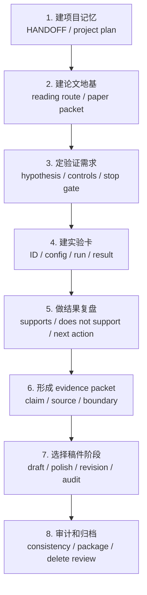

# 教程导航

这页是 `sci-research-codex-skills` v2 的使用入口。它不是 API 文档，而是告诉你：什么时候该用哪一个 Skill，输出应该长什么样，如何避免把研究项目越做越乱。仓库继续沿用全部 8 个公开名称：`sci-research-manager` 统一研究状态和证据边界，`academic-manuscript-writing` 统一稿件阶段和主线，其余 Skill 返回有界产物。

> 当前稳定 Release 是 `v2.0.0`；本页同时覆盖 `main` 分支 Changelog `Unreleased` 中的阶段化写作、两库接口和按需工作流升级。

在线渲染版入口：

- [GitHub Pages 教程首页](https://godzhiwzz-create.github.io/sci-research-codex-skills/tutorials/)
- [Attention Is All You Need 精读 HTML 演示](https://godzhiwzz-create.github.io/sci-research-codex-skills/tutorials/examples/attention-is-all-you-need/)
- [v2 架构与兼容说明](../architecture-v2.md)

## 你现在遇到的情况

| 你遇到的问题 | 先用哪个 skill | 看哪个教程 |
|---|---|---|
| 项目文件乱，实验太多，看不懂主线 | `sci-research-manager` + `sci-experiment-manager` | [项目管理教程](project-management.md) |
| 想快速读懂一篇论文，还要有图表和证据线 | `sci-literature-manager` + `sci-paper-reader` | [论文精读教程](paper-deepread.md) |
| 想直接看论文精读成品 | `sci-paper-reader` | [Attention Is All You Need 精读演示](examples/attention-is-all-you-need/README.md) |
| 实验结果和论文 claim 对不上 | `sci-research-manager` + `sci-result-auditor` | 先读 README 的“论文主张必须有证据边界” |
| 想清理 checkpoint、日志和旧版本 | `sci-asset-manager` | 先生成 delete review，不直接删 |
| 要写、润色或修订论文 | `academic-manuscript-writing` | 先选择一个稿件阶段并确认 evidence packet |
| 要判断最终投稿包是否可提交 | `sci-research-manager` + `academic-manuscript-writing` | 先冻结内容，再走最终提交六门审核 |

## 推荐路线

下面是获准推进整个项目时的路线，不是每次提问都要走一遍的清单：概念讨论只回答问题；已知论文只增量入库；需要判断新颖性或是否值得投入时先核验最近先例。完整阅读包、实验和投稿审计分别在进入相应任务时开启。


```mermaid
flowchart TD
  A["1. 建项目记忆<br/>HANDOFF / project plan"] --> B["2. 建论文地基<br/>reading route / paper packet"]
  B --> C["3. 定验证需求<br/>hypothesis / controls / stop gate"]
  C --> D["4. 建实验卡<br/>ID / config / run / result"]
  D --> E["5. 做结果复盘<br/>supports / does not support / next action"]
  E --> F["6. 形成 evidence packet<br/>claim / source / boundary"]
  F --> G["7. 选择稿件阶段<br/>draft / polish / revision / audit"]
  G --> H["8. 审计和归档<br/>consistency / package / delete review"]
```

## 快速选择

### 我想“接管一个长期项目”

看 [项目管理教程](project-management.md)。

你会学到：

- 如何初始化项目记忆；
- 如何让 Codex 每次从轻量索引开始读，而不是乱扫日志；
- 如何把多个小实验合并成 family card；
- 如何输出方向决策，而不是继续调参；
- 如何维护 `PROJECT_HANDOFF.md`、`QUERY_MAP.md`、`EXPERIMENT_INDEX.md`、`DECISION_LOG.md`。

### 我想“认真读懂一篇论文”

看 [论文精读教程](paper-deepread.md)。

也可以直接看成品：[Attention Is All You Need 精读演示](examples/attention-is-all-you-need/README.md)。

你会学到：

- 如何给一篇 PDF 生成中文精读包；
- 如何让 Codex 先写 MD，再做 HTML/PPT/Word；
- 如何加入摘要截图、图表解读、方法路线图；
- 如何把项目中立的论文理解包与交给 research owner 的候选启发分开；
- 如何避免“只看摘要就写总结”。

### 我想“写、润色或修订论文”

先调用 `academic-manuscript-writing`，只选一个阶段：

```text
initial_draft / manuscript_polish / pre_submission_audit /
major_revision_preserving / minor_revision_local /
final_submission_audit / proof_correction
```

它负责稿件主线、正文、修订范围和回复；文献、统计、图、Word/PDF 等专门 Skill 只接收有界输入并把结果交回。若新增或扩大 claim，先退回 `sci-research-manager` 核验证据，不能从流畅 prose 反向晋升结论。

## 一句话原则

这套 skills 的核心不是让 Codex 更会堆文件，而是让 Codex 每一步都能回答：

```text
我现在在解决什么问题？
这一步产出的证据是什么？
它支持什么，不支持什么？
下一步是继续、重定向，还是停止？
```
