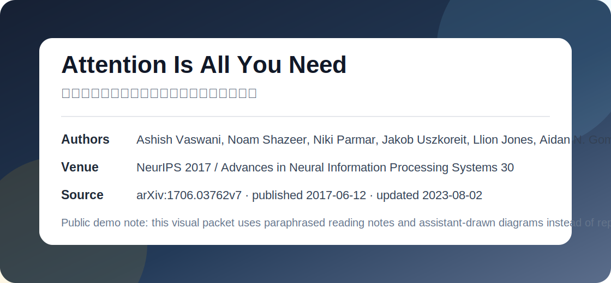
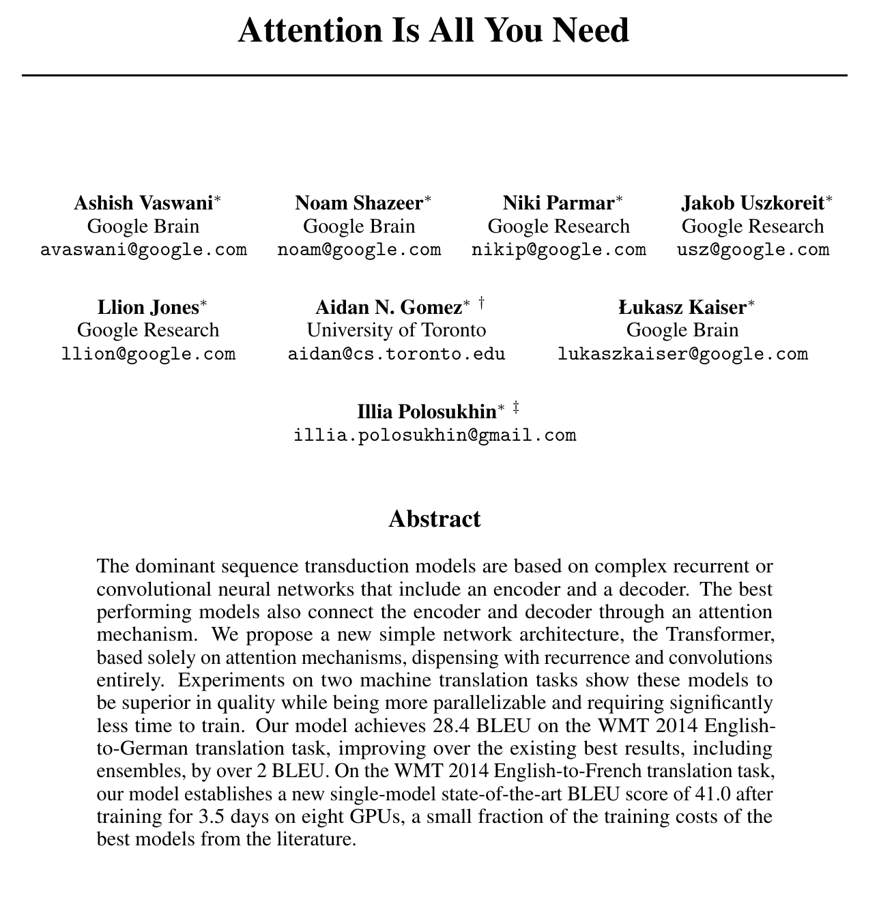
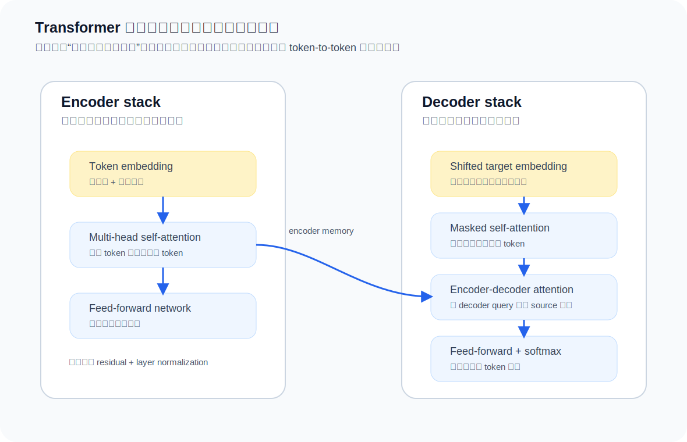
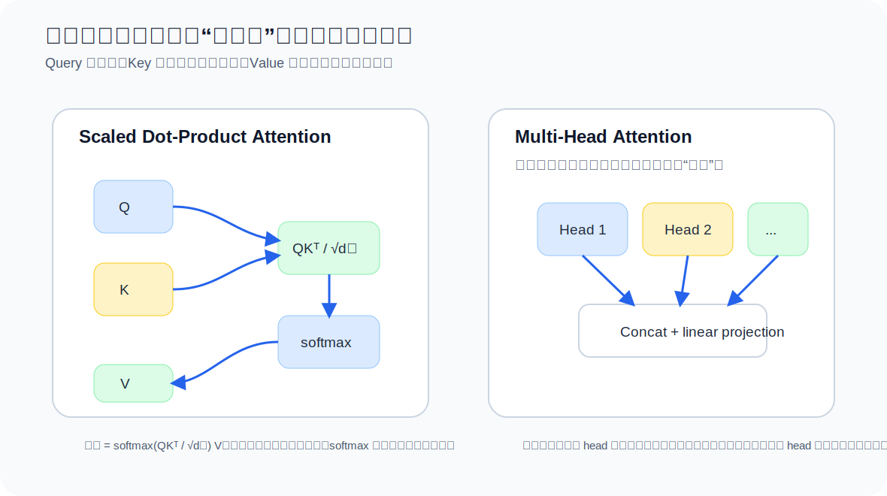
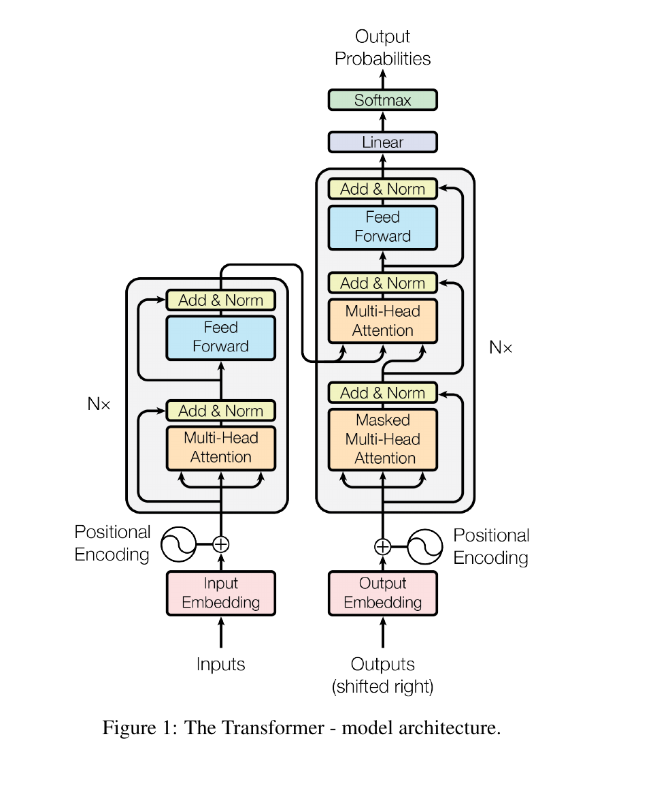
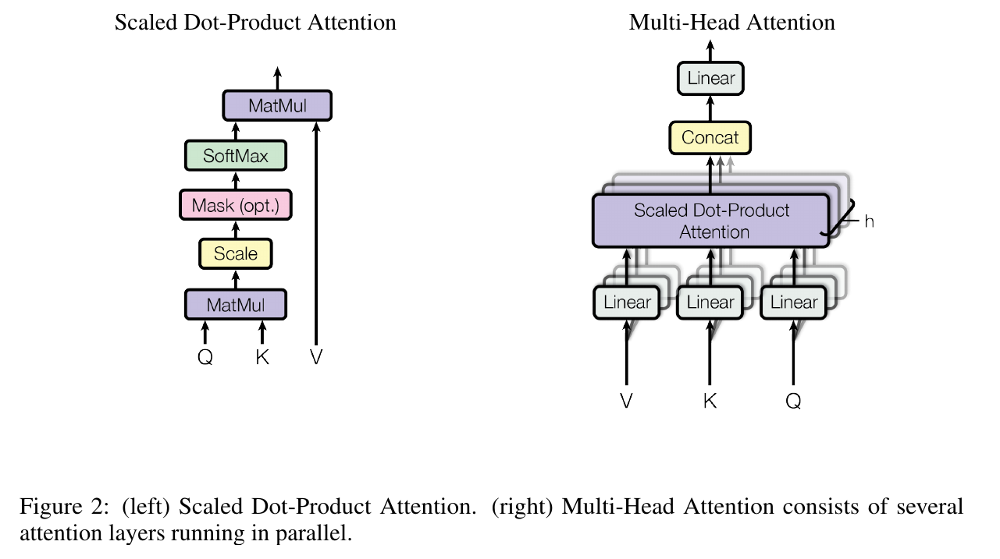
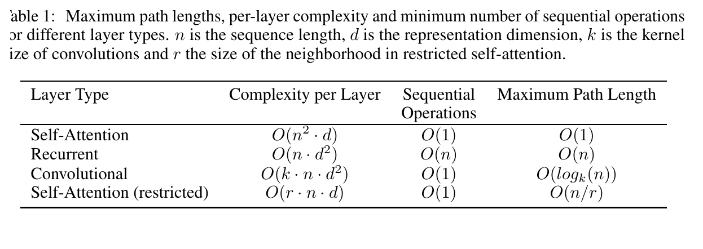
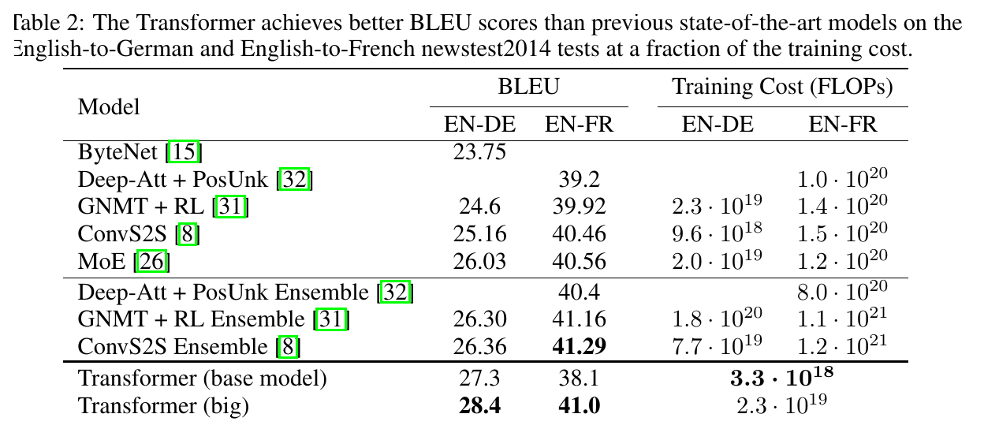
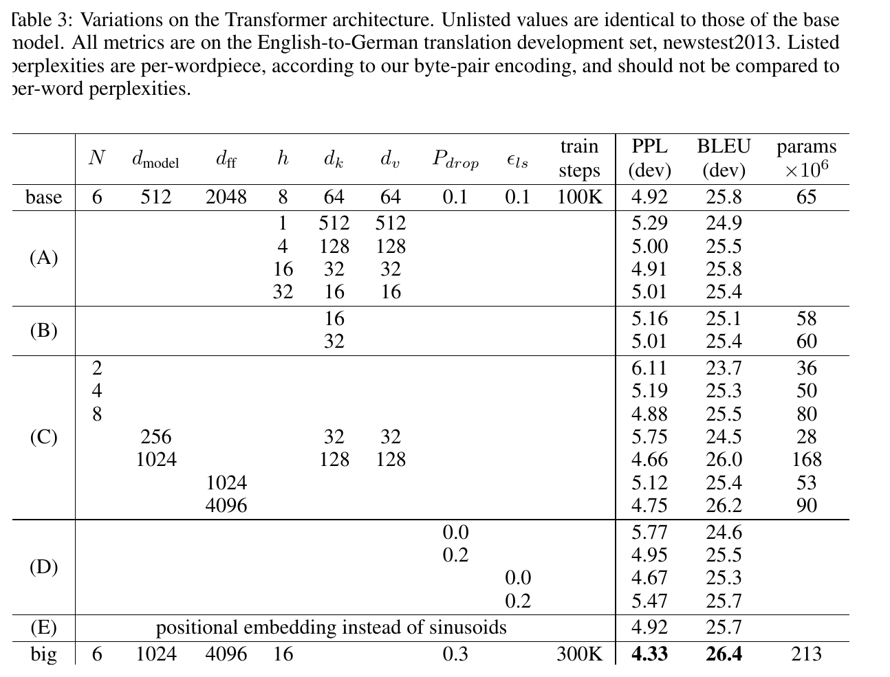
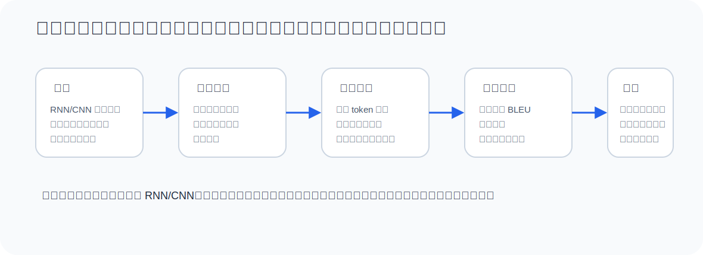

# Attention Is All You Need
## 只用注意力机制构建序列建模架构

## 0. 论文身份

- Authors: Ashish Vaswani, Noam Shazeer, Niki Parmar, Jakob Uszkoreit, Llion Jones, Aidan N. Gomez, Lukasz Kaiser, Illia Polosukhin
- Venue / year: NeurIPS 2017, Advances in Neural Information Processing Systems 30
- Paper type: 方法论文 / 序列建模架构论文
- Source status: arXiv and NeurIPS proceedings metadata verified on 2026-05-22
- arXiv: [1706.03762v7](https://arxiv.org/abs/1706.03762)
- Proceedings page: [NeurIPS paper page](https://papers.nips.cc/paper/7181-attention-is-all-you-need)
- Journal partition note: conference proceedings paper; JCR/CAS journal partitions do not apply.
- Demo note: this public demo uses paraphrased Chinese explanations and assistant-drawn diagrams instead of reproducing long original abstract text.



## 1. 摘要解读



上面是论文首页局部截图，包含标题、作者和摘要。精读时先看它的好处是：我们不会只听二手概括，而是先确认论文自己把问题、方法和证据放在什么位置。下面的中文解读不复写长摘要，而是把摘要拆成四个问题：它认为旧方法哪里卡住？它提出什么原则？它拿什么结果证明？它没有证明什么？

这篇论文的摘要其实在讲一个非常强的架构判断：当时主流序列转导模型主要依赖循环网络或卷积网络，并通常在 encoder-decoder 结构中再接 attention。作者反过来问：如果 attention 已经是连接远距离信息的关键，是否还需要循环和卷积作为主干？

论文的核心回答是：不需要。它提出 Transformer，把主干改成只依赖 attention 的结构，也就是摘要里说的 “based solely on attention mechanisms”，并且 “dispensing with recurrence and convolutions entirely”。这不是把 attention 加到 RNN 上，而是把序列建模的基本计算单位从“按时间递推”改成“token 之间直接通信”。

摘要声称的主要证据来自两个机器翻译任务。论文报告在 WMT 2014 English-to-German 上达到 28.4 BLEU，在 English-to-French 上达到 41.8 BLEU，并强调训练可以更并行、时间成本更低。也就是说，摘要不是只说“结构更优雅”，而是同时承诺质量、并行效率和训练成本。

摘要没有证明三件事：第一，它没有证明 attention-only 架构在所有序列任务上都必然最优；第二，它没有解释 Transformer 后来在大规模预训练中的全部能力；第三，它没有解决长序列二次复杂度问题。摘要真正证明方向是：在当时机器翻译主战场上，去掉 recurrence / convolution 不但可行，而且能成为新的主干范式。

## 2. 读这篇论文前需要知道什么

如果你之前不了解 NLP 或 Transformer，先把下面这些概念搞清楚。它们不是“背景装饰”，而是理解论文主张所必需的最低词汇表。

**Sequence transduction** 指把一个序列变成另一个序列。机器翻译就是典型例子：输入英文句子，输出德文句子。输入和输出长度可以不同，因此模型不仅要理解每个词，还要学会源语言和目标语言之间的对应关系。

**Token** 是模型处理的基本单位，可以是词、子词或符号。论文里说的 sequence 不是人脑里“一整句话的意思”，而是 token 列表。模型每一步都在处理这些 token 的向量表示。

**Encoder / Decoder** 是序列到序列模型常见框架。Encoder 读输入句子并形成上下文表示；decoder 根据已经生成的目标 token 和 encoder 表示，继续生成下一个 token。可以把 encoder 想成“读题”，decoder 想成“作答”。

**Baseline** 是用来比较的新旧方法。Table 2 里那些 RNN、CNN、ensemble 模型就是 Transformer 需要超过的参照物。没有 baseline，就无法判断一个新模型到底是结构有效，还是只是训练得更久、模型更大、数据更多。

**BLEU** 是机器翻译常用自动指标，大体衡量机器译文和参考译文的 n-gram 重合程度。这里越高越好，但它不是人类翻译质量的完整替代。读结果表时要把 BLEU 当作 benchmark 证据，而不是“翻译完全正确”的证明。

**Parallelization** 是能否把很多位置同时计算。RNN 必须按时间步递推，前一步没算完后一步不能开始；attention 更容易用矩阵乘法一次计算很多 token 之间的关系，因此训练更适合 GPU/TPU。

一个具体例子：输入是 “I love apples”，输出是 “Ich liebe Äpfel”。RNN 会按顺序读 I -> love -> apples；Transformer 会让每个 token 直接和其他 token 计算关系。生成德文词时，decoder 可以通过 cross-attention 去看英文中最相关的位置。读这篇论文时要盯住的问题是：作者不是只想提高 BLEU，而是要证明“去掉递推和卷积之后，模型仍能学习序列关系，并且更容易并行训练”。

## 3. 一分钟讲明白

这篇论文解决的是序列到序列任务中“如何让一个 token 获得其他 token 的上下文信息”的问题。过去 RNN 按时间步递推，长距离信息要经过很多步传递；CNN 可以并行，但需要堆叠多层卷积扩大感受野；attention 则允许一个 token 直接对所有 token 分配权重。

Transformer 的关键想法是：既然 attention 能直接建立 token-to-token 关系，那就让它成为主干。Encoder 负责让源句子的每个 token 看完整句子；decoder 负责在已生成目标词的条件下逐步预测下一个词，并通过 cross-attention 读取 encoder 表示。

最该记住的不是“Transformer 有很多层”，而是这个范式变化：

```text
RNN/CNN: 通过时间递推或局部卷积传播上下文
Transformer: 通过 self-attention 让 token 直接选择要看的 token
```

## 4. 这篇论文为什么会出现

在 Transformer 之前，encoder-decoder 是机器翻译等序列转导任务的常见框架。RNN/LSTM/GRU 很自然地适合序列，因为它们按顺序读 token；但是它们的顺序依赖让训练难以充分并行。对于长句子，远距离 token 的信息还要经过很多递推步骤，优化和建模都更困难。

CNN 序列模型提供了更好的并行性，但卷积天然是局部操作。要让两个相距很远的 token 交换信息，就要堆多层或使用更复杂的卷积结构。也就是说，CNN 改善了并行，但没有从根本上把长程依赖变成“一步可达”。

Attention 原本常作为 encoder 和 decoder 之间的辅助机制：decoder 在生成每个词时，根据当前状态去关注 source 句子的不同位置。Transformer 的创新在于，它不再把 attention 当辅助桥梁，而是把它提升为序列表示学习的主运算。

## 5. 方法路线图



Transformer 的输入是 token 序列。每个 token 先变成 embedding，再加上 positional encoding，因为 attention 本身并不知道顺序。然后进入 encoder stack 和 decoder stack。

Encoder 每层有两个主要子层：multi-head self-attention 和 position-wise feed-forward network。Self-attention 让每个输入 token 都能看见其他 token；feed-forward network 则对每个位置独立做非线性变换。每个子层外面都有 residual connection 和 layer normalization，用来稳定训练。

Decoder 每层有三个子层。第一层是 masked self-attention，它只能看已经生成的目标 token，不能偷看未来。第二层是 encoder-decoder attention，也叫 cross-attention，它用目标侧 query 去读取源句子的 encoder 表示。第三层仍是 position-wise feed-forward network。

最核心的公式是 scaled dot-product attention：

```text
Attention(Q, K, V) = softmax(QK^T / sqrt(d_k)) V
```

直观解释：

- Q 是 query：当前位置想问什么。
- K 是 key：每个位置提供什么索引特征。
- V 是 value：真正要被汇总的信息。
- QK^T 计算 query 和每个 key 的匹配程度。
- 除以 sqrt(d_k) 是为了控制数值尺度。
- softmax 把匹配程度变成注意力权重。
- 最后用权重加权汇总 value。



Multi-head attention 的作用是让模型并行学习多种关系。一个 head 可以偏向局部短语结构，另一个 head 可以偏向长距离依赖，另一个可能学习对齐关系。论文不是要求每个 head 都有人工解释，而是让多个低维 attention 子空间共同表达复杂关系。

## 6. 图表阅读指南

### Figure 1: Transformer architecture



这张图是整篇论文最重要的结构图。第一眼看会觉得方块很多，但读法其实很固定：先看左边 encoder，再看右边 decoder；先看每层内部有哪些子模块，再看模块之间的数据怎么流动。Encoder 的关键是 self-attention + feed-forward；decoder 多了 masked self-attention 和 encoder-decoder attention。

这张图真正支持的证据是：论文确实把 attention 做成了主干，而不是在 RNN/CNN 外面加 attention。你应该重点看 “Multi-Head Attention” 出现的位置：encoder 里有，decoder 自身有，decoder 读取 encoder 也有。它说明 attention 不再只是翻译时的对齐辅助，而是整个模型的信息路由机制。

它不直接证明性能提升。性能是否成立要看后面的 translation result table 和 ablation table。

### Figure 2: Scaled Dot-Product Attention and Multi-Head Attention



这张图解释 attention 的两个层级。左边是单个 scaled dot-product attention：Q 和 K 先相乘得到匹配分数，scale 控制数值大小，mask 可阻止 decoder 偷看未来 token，softmax 把分数变成权重，最后用权重汇总 V。右边是 multi-head attention：把 Q/K/V 投影到多个子空间，每个 head 独立做一次 attention，再拼接起来。

新手读这张图最容易卡在 Q/K/V。可以这样理解：Q 是“我现在想找什么”，K 是“每个位置挂着什么标签”，V 是“如果我关注这个位置，真正拿走什么内容”。Multi-head 不是简单重复同一件事，而是允许模型同时用多套“找信息的标准”看同一句话。

它支持论文的机制主张：Transformer 的核心运算可以被清楚拆成可并行的矩阵乘法与加权汇总。

### Table 1: Complexity and path length comparison



这张表非常关键，因为它不是性能表，而是架构理由表。它比较 self-attention、recurrent layer、convolutional layer 在每层计算复杂度、顺序操作数量和最大路径长度上的差异。读表时先看列名：complexity per layer 表示计算量；sequential operations 表示有多少必须按顺序做；maximum path length 表示两个远距离位置传递信息要经过多长路径。

Self-attention 的优势主要在后两列：顺序操作少，任意两个位置之间路径短。这正好对应论文的问题设定：RNN 难并行，CNN 远距离依赖要堆层。Table 1 不是说 self-attention 在任何长度下都最省计算，因为它也有和序列长度平方相关的复杂度；它说的是在当时翻译长度范围内，attention 的并行和路径长度优势很有吸引力。

这张表支持“为什么要替代 RNN/CNN”，而不是证明最终 BLEU 一定更高。

### Table 2: Translation results



这张表是主结果证据。它比较 Transformer 与已有模型在 WMT 2014 English-to-German 和 English-to-French 上的 BLEU 与训练成本。论文报告 Transformer big 在 En-De 上达到 28.4 BLEU，En-Fr 上达到 41.8 BLEU。读表时不要只找最高数字，还要看“它比谁高”和“成本是否更低”。

这张表的证明路线是：如果一个 attention-only 模型不仅能达到或超过强 baseline，而且训练成本还更低，那么“去掉 recurrence / convolution”就不是牺牲性能换结构简洁，而是可能形成新的主干范式。这里的边界也很清楚：任务是机器翻译，指标是 BLEU，训练条件和模型规模都属于证据的一部分。

这张表支持论文核心贡献，但它主要来自机器翻译任务，不能直接外推到所有序列或视觉任务。

### Table 3: Model variations



这是消融证据。它检查 attention head 数、key/value 维度、模型维度、feed-forward 维度、dropout、label smoothing 等变化对结果的影响。消融表的作用不是“炫耀更多数字”，而是回答：Transformer 的哪些设计是关键，哪些只是容量或训练细节。

读这张表时不要只找最高分，而要看变化方向。例如 head 数、维度、dropout 等改变后，模型表现是否稳定；如果某个设置一变就大幅变差，说明它可能是结构或训练 recipe 的敏感点。这张表告诉我们 Transformer 不是单个 attention 公式就结束，训练细节、容量配置和正则化同样重要。

### Parsing experiment

论文还把模型用于 English constituency parsing，用来说明 Transformer 不是只能做翻译。这个结果是泛化证据，但不是主证据。它说明架构有跨任务潜力，但不能替代更大规模和更多任务的后续验证。

## 7. 证据链



```text
问题：RNN/CNN 主干在长程依赖和并行训练上有结构瓶颈。
原因假设：序列建模不一定必须通过递推或局部卷积传播上下文。
方法原则：让 token 之间通过 self-attention 直接通信。
机制实现：encoder/decoder stack + multi-head attention + positional encoding + FFN。
主证据：机器翻译 BLEU 和训练成本。
结构证据：复杂度与路径长度分析。
消融证据：head 数、维度、dropout、label smoothing 等设计变化。
泛化证据：constituency parsing 尝试。
边界：主要任务是翻译；训练 recipe 很重要；attention 对长度是二次复杂度。
```

## 8. 和其他论文的关系

Transformer 继承了 encoder-decoder 框架，也继承了 attention 用于对齐和上下文读取的思想。它改变的是 attention 的地位：从辅助模块变成表示学习主干。

相对于 RNN seq2seq，它去掉了逐步递推；相对于 CNN seq2seq，它避免了靠局部卷积堆叠来传播长程信息；相对于早期 attention 机制，它把 attention 从 decoder 读 source 的桥梁扩展为 encoder 和 decoder 内部都可使用的通用信息路由。

它后续影响了两条大线：一条是自然语言处理中的预训练语言模型，另一条是把 Transformer 思想迁移到语音、视觉、多模态、强化学习和科学建模等领域。后续论文并不是简单复刻原始结构，而是在位置编码、长序列复杂度、归一化、稀疏注意力、预训练目标和尺度规律上继续发展。

## 9. 最该记住什么

1. Transformer 的核心创新是把 attention 从辅助机制提升为序列建模主干。
2. Self-attention 的根本优势是全局 token-to-token 路由和高并行度。
3. Positional encoding 是必要补丁：没有 recurrence/convolution 后，模型需要额外知道顺序。
4. Multi-head attention 的意义是让模型在多个子空间中并行学习不同关系。
5. 论文证据主要来自机器翻译，并由复杂度分析、消融和 parsing 泛化实验补充。

不能过度声称：

- 不能说它证明 attention 在所有任务上都优于所有结构。
- 不能忽略训练 recipe、模型规模和数据任务设置。
- 不能把后来的大模型能力全部归因于这篇论文本身。
- 不能忘记长序列二次复杂度这个结构边界。

## 10. 新手 FAQ / 容易误解的点

**误解 1：Attention 就是 Transformer。**
不是。Attention 是核心运算，但 Transformer 是一套完整架构：self-attention、cross-attention、positional encoding、feed-forward、residual、normalization、masking 和训练 recipe 合在一起才形成可用系统。

**误解 2：论文证明 RNN/CNN 永远没用了。**
不是。论文证明的是在当时机器翻译任务和设定下，attention-only 主干更有质量和效率优势。它没有证明所有序列、视觉、音频或小数据任务里 RNN/CNN 都应该被替代。

**误解 3：Multi-head 的每个 head 都一定有明确语义。**
不一定。多头机制让模型有机会在不同子空间学习不同关系，但论文图示和后续可视化不能保证每个 head 都稳定对应一个人类可命名功能。

**误解 4：BLEU 高就等于翻译完全好。**
不是。BLEU 是自动评价指标，适合快速比较系统，但它不能完整代表忠实性、流畅性和语义质量。读 Table 2 时应把 BLEU 当作当时主流 benchmark 证据，而不是全部质量真相。

## 11. Project Attachment: public demo only

- Date: 2026-05-22
- Current project stage: repository tutorial demonstration
- Why this paper matters here: it is a familiar, high-impact paper suitable for showing what `sci-paper-reader` should produce: identity, abstract interpretation, method route, diagram, figure/table proof cards, evidence spine, limitations, and paper relation.
- What it supports: this demo shows the deep-reading artifact format.
- What it does not support: it is not project evidence for any user's research project.
- Evidence boundary: literature demonstration only.
